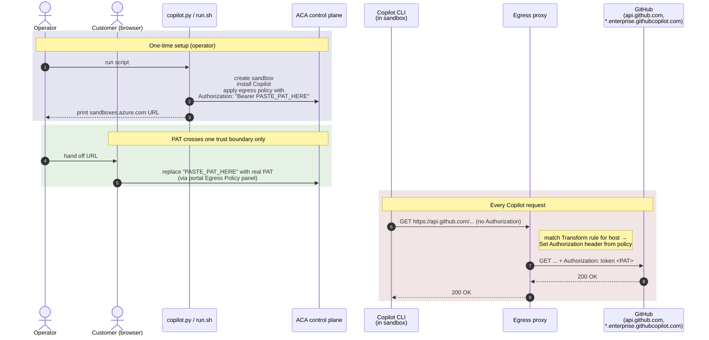

# 02 — Coding agents

Run **GitHub Copilot CLI** inside a fresh Azure Container Apps sandbox,
under a deny-by-default egress policy, **without ever placing the
customer's GitHub PAT inside the sandbox**. The egress proxy attaches
the credential to outbound requests at the network boundary; the
agent process itself runs unauthenticated.

Because the workload has no credentials and no outbound paths beyond a
handful of GitHub hosts, you can hand the agent a sweeping prompt and
turn on auto-approval (`--allow-all-tools` and friends) without the
usual risk. See [YOLO mode is now safe](#yolo-mode-is-now-safe) below.

This is the template the `claude-code/` and `codex/` flows will follow.

## YOLO mode is now safe

Coding agents ship with an auto-approval mode — `copilot --allow-all-tools`,
Claude Code's `--dangerously-skip-permissions`, Codex's `--full-auto`, etc.
On a developer's laptop those flags are scary: a prompt-injection or
misjudgment can `rm -rf`, exfiltrate `~/.aws/credentials`, or push to
the wrong branch.

Inside this sandbox they're boring:

- **No creds to exfiltrate.** The PAT lives only on the egress proxy.
  Nothing the agent reads from env, disk, or memory is a secret.
- **No outbound paths to exfiltrate to.** Deny-default egress means
  `curl attacker.com` doesn't resolve, let alone connect.
- **No host to damage.** The container is ephemeral and scoped; `rm -rf /`
  hurts nothing you care about and is gone when the sandbox is deleted.
- **Blast radius = one sandbox.** Whatever happens stays inside it.

```bash
# Inside the sandbox shell, after pasting the PAT:
copilot --allow-all-tools -p "refactor this repo end-to-end"
```

Let it rip.

## Concepts

The scenario demonstrates four ideas that compose into a workable
zero-trust posture for autonomous agents:

1. **No credentials in the workload.** `copilot` runs in a container
   where the PAT is not present in env vars, on disk, or in process
   memory. A prompt-injection attack, a malicious dependency, or a
   buggy log line cannot exfiltrate what isn't there.
2. **Credential mediation at the egress boundary.** The sandbox's
   egress proxy holds the PAT and stamps it onto the `Authorization`
   header of outbound requests to specific hosts (Transform rules).
   The workload sends an unauthenticated request; the proxy makes it
   authenticated on the wire.
3. **Least-privilege egress.** Default action is `Deny`. Only the four
   GitHub host families Copilot needs are allowed out at all. A
   compromised agent cannot reach `attacker.com` to exfiltrate
   *anything* — including what little context it has.
4. **Customer-controlled credential lifecycle.** The PAT enters the
   system through the customer's browser session at
   [sandboxes.azure.com](https://sandboxes.azure.com), not through a
   developer's terminal. It can be rotated, revoked, or scoped down
   without re-running any tooling on the operator side.

## Architecture



### Where the credential lives (and doesn't)

| Location                                | PAT present? |
| --------------------------------------- | ------------ |
| Operator script (`copilot.py` / `run.sh`) | ❌           |
| Operator env / shell history / tempfiles  | ❌           |
| Customer browser (during paste)           | ✅           |
| ACA control plane (egress policy state)   | ✅           |
| Egress proxy (in-memory rule cache)       | ✅           |
| **Sandbox container env / disk / memory** | **❌**       |
| GitHub-bound request on the wire          | ✅ (set by proxy) |

The single trust boundary the PAT crosses is from the **customer's
browser** to the **ACA control plane**. Operator-side tooling is
deliberately blind to it.

## Threat model (what this stops and what it doesn't)

**Stops:**
- An agent process logging or printing its own environment.
- A malicious npm/pip dependency reading `~/.netrc` or `$GITHUB_TOKEN`.
- A prompt-injection attack instructing the agent to `curl attacker.com`
  (blocked by deny-default egress; the agent can't even resolve the
  host).
- Operator terminal screenshots / shell-history backups leaking the PAT.

**Does not stop:**
- A principal with read access to the sandbox group reading the
  Transform rule values out of the egress policy. **Use this scenario
  in an isolated sandbox group with tightly scoped RBAC.**
- The customer's own browser session being compromised at paste time.
- The agent abusing the credential it gets access to *transitively*
  via authenticated GitHub responses (e.g. issuing API writes against
  repos the PAT can touch). Scope the PAT minimally and time-box it.

## Prerequisites

- The shared sandbox baseline has been provisioned —
  `samples/sandboxes/setup/python/setup.py` **or**
  `samples/sandboxes/setup/cli/setup.sh`.
- A GitHub PAT with Copilot access (see below).

### Getting a GitHub PAT

You need a token that can authenticate to both `api.github.com` and
`api.enterprise.githubcopilot.com`:

- **If you already use the GitHub CLI**: run `gh auth token` and use
  that value.
- **Otherwise**: create a classic PAT at
  <https://github.com/settings/tokens/new?scopes=read:user,repo,workflow&description=ACA%20sandbox%20Copilot%20CLI>.
  The pre-filled scopes match what `gh auth login --web` requests.

Your Copilot subscription (Individual, Business, or Enterprise) must
be active on the account that owns the token — the token only proves
identity; entitlement is checked server-side by GitHub.

## How to run

### Python (portal-only)

```bash
cd gh-copilot-cli/python
pip install -r requirements.txt
python copilot.py
```

The Python flow prints the portal URL and waits — you paste the PAT
in the portal and run `copilot` from the portal's `bash` tab.

### CLI (bash, with optional in-terminal shell)

```bash
cd gh-copilot-cli/cli
./run.sh
```

The CLI flow prints the same URL, waits for you to paste, and then
drops you into an **interactive shell inside the sandbox** via
`aca sandbox shell`. You can run `copilot` from your own terminal
instead of the portal. When you `exit` the shell, the script deletes
the sandbox. (You can also still use the portal bash tab if you
prefer; just press Enter without opening a shell session.)

Both flows produce the same sandbox configuration: deny-default
egress, four GitHub host-allows, three placeholder Transform rules.

For Copilot-specific details — where to paste the PAT in the portal
(with screenshot), what each host rule is for, PAT scope guidance, and
the verification recipe — see [`gh-copilot-cli/README.md`](gh-copilot-cli/README.md).

## What it composes

- [guides/01-sandboxes](../../guides/01-sandboxes) — `begin_create_sandbox` + `exec`
- [guides/08-egress](../../guides/08-egress) — `set_egress_default("Deny")`, host-allow rules, **plus Transform rules** (not covered in the egress guide)

## Operational notes

- **Installer phase vs. agent phase.** Copilot CLI is installed under
  the default-allow egress policy (the sandbox needs to reach `gh.io`
  and its release hosts to bootstrap). The "no credential in the
  workload" guarantee applies after the script swaps to deny-default
  + Transform rules — i.e. for the agent phase, which is what
  customers actually run.
- **Footgun: `*.githubcopilot.com` host rules.** A host-allow rule for
  `*.githubcopilot.com` short-circuits the matching Transform rule and
  the request goes out unauthenticated. The Python script asserts no
  such rule exists after applying its rules; the bash flow `grep`s
  `policy.yaml` for the same string before applying. If you edit the
  policy in the portal later, don't add such a rule.
- **Cleanup is best-effort.** Pressing Enter in the operator terminal
  deletes the sandbox (and the egress policy with its pasted PAT). The
  Python `finally` and bash `trap` also fire on Ctrl+C and most exits,
  but **not** reliably on `kill -9`, terminal-window close, SSH drop,
  laptop sleep, or host crash. If you suspect a sandbox leaked, list
  by label and delete manually:

  ```bash
  aca sandbox list -l scenario=coding-agents
  aca sandbox delete --id <id> --yes
  ```

  For an extra belt-and-braces posture, use a short-lived PAT and
  revoke it at <https://github.com/settings/tokens> after the demo.
- **Compatibility note.** This flow injects a single `Authorization`
  header on three hosts using the same PAT. It was validated against
  the Copilot CLI version current at the time of writing. Future
  Copilot CLI auth changes (e.g. token-exchange to a short-lived
  Copilot bearer) may require updating the rule set; if
  `curl api.github.com/user` succeeds but `copilot` fails, check
  whether Copilot CLI's wire protocol has changed.

## Coming soon

- [`claude-code/`](claude-code) — same pattern for Anthropic Claude Code.
- [`codex/`](codex) — same pattern for OpenAI Codex CLI.

Both are stub folders today. The Copilot CLI flow is the template
they'll follow.
