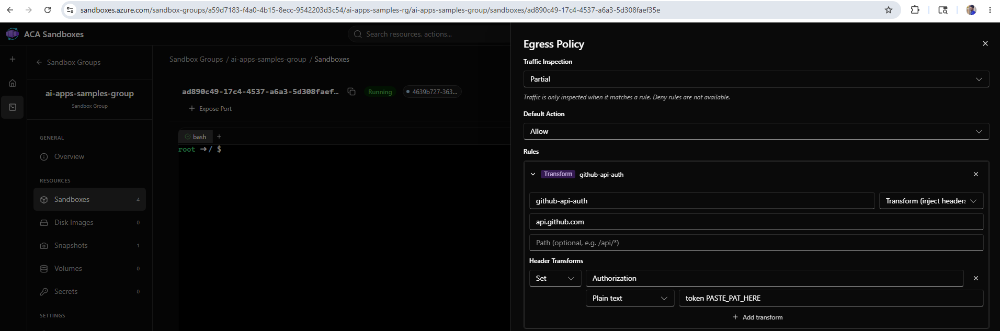

# GitHub Copilot CLI

GitHub Copilot CLI ([`copilot`](https://github.com/github/copilot-cli))
running inside an ACA sandbox under the portal-paste PAT-injection
pattern. The agent process has no credentials; the egress proxy stamps
the customer's PAT onto outbound requests.

See [`../README.md`](../README.md) for the scenario-level concepts,
architecture diagram, YOLO-mode framing, and threat model. **Read that
first** — this file only covers what's specific to Copilot CLI.

## Pick a flow

| Folder                  | When to use                                                                 |
| ----------------------- | --------------------------------------------------------------------------- |
| [`python/`](python/)    | You prefer the SDK. Run `copilot` from the portal's `bash` tab.             |
| [`cli/`](cli/)          | You prefer bash. After paste, the script drops you into `aca sandbox shell` so you can run `copilot` from your own terminal. |

Both flows produce the same sandbox: deny-default egress, four
GitHub host-allows, three Transform rules with `Authorization` Values
of `token PASTE_PAT_HERE` / `Bearer PASTE_PAT_HERE`.

## What's Copilot-specific

### GitHub hosts the proxy must allow

| Host                                       | Why                              | Transform value                |
| ------------------------------------------ | -------------------------------- | ------------------------------ |
| `api.github.com`                           | repo/user API                    | `token <PAT>`                  |
| `api.enterprise.githubcopilot.com`         | Copilot completions / chat       | `Bearer <PAT>`                 |
| `telemetry.enterprise.githubcopilot.com`   | Copilot client telemetry         | `Bearer <PAT>`                 |
| `*.github.com`                             | gh CLI, web flows, raw content   | allow (no auth injection)      |
| `*.githubusercontent.com`                  | raw file content, codeload       | allow (no auth injection)      |
| `gh.io`                                    | installer redirect               | allow                          |
| `*.github.io`                              | docs / pages content             | allow                          |

The three `*githubcopilot.com` hosts use **Transform** rules so the
proxy injects `Authorization`. The remaining four use plain **Allow**
host rules — `gh` CLI and HTTPS fetches work without proxy-side auth.

> **Footgun**: do NOT add a host-allow rule for `*.githubcopilot.com`.
> Host rules short-circuit before Transform rules fire, which would
> silently drop the injected `Authorization` header. Both scripts
> guard against this.

### Getting a PAT

You need a token that authenticates to both `api.github.com` and
`api.enterprise.githubcopilot.com`:

- **If you already use the GitHub CLI**: `gh auth token` → use that
  value.
- **Otherwise**: create a classic PAT at
  <https://github.com/settings/tokens/new?scopes=read:user,repo,workflow&description=ACA%20sandbox%20Copilot%20CLI>.
  Pre-filled scopes match what `gh auth login --web` requests and are
  sufficient for Copilot CLI.

Your Copilot subscription (Individual, Business, or Enterprise) must
be active on the account that owns the token. The token only proves
identity; entitlement is checked server-side.

### Installer

The flow installs Copilot CLI inside the sandbox via the official
`gh.io/copilot-install` script, **before** the egress policy is locked
down (the installer needs to reach hosts the locked-down policy would
deny). The "no credential in the workload" guarantee applies to the
agent phase, not the installer phase.

### YOLO mode

Once the PAT is pasted, in either the portal bash tab or the local
shell opened by `cli/run.sh`:

```bash
copilot --allow-all-tools -p "<your prompt>"
```

There are no credentials to exfiltrate and no outbound paths beyond
the seven GitHub hosts above. Let it rip.

### Verifying

From inside the sandbox:

```bash
curl -i https://api.github.com/user | head
```

`200 OK` with your GitHub login proves the `api.github.com` rule
worked. A `401` means either the rule edit hasn't applied yet (wait a
few seconds and retry), the PAT is wrong, or the scheme prefix was
dropped from the Value.

This only verifies the `api.github.com` path. The two
`*.enterprise.githubcopilot.com` rules are exercised on the first
`copilot` call itself.

## Where to paste the PAT

After the script provisions the sandbox, open the printed URL. If the
portal lands on a tenant picker, switch to the tenant your sandbox
subscription lives in. The right-hand **Egress Policy** panel shows
the three Transform rules, each with `PASTE_PAT_HERE` in the Value
field — replace that text with your PAT (keep the `token ` or
`Bearer ` prefix). Save.



After Save, **do not screenshot or share the Egress Policy panel** —
the saved Values contain your PAT verbatim. Likewise don't run
`aca sandbox egress show` against this sandbox; its output prints the
rule Values.
