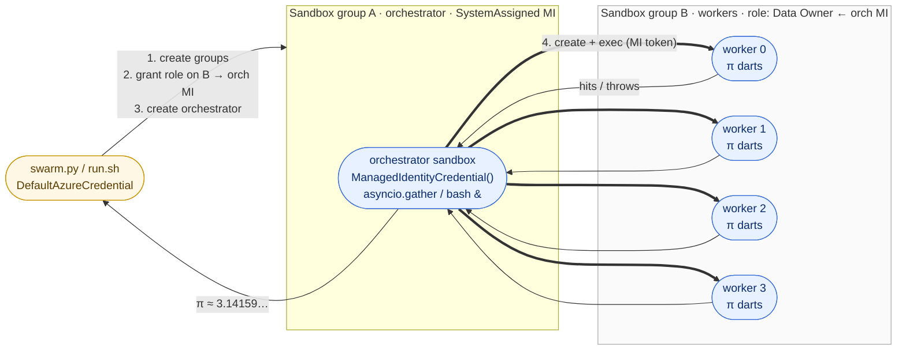

# 01 — Sandbox inception

An orchestrator agent running **inside** a sandbox in Group A spawns N
worker sandboxes in Group B, dispatches a task to each, and aggregates
the result. The orchestrator authenticates with the system-assigned
managed identity on its own sandbox group — no credential ever lives
inside the agent.



## What this demonstrates

Four things a customer can verify by reading the script and watching
it run. The Monte Carlo Pi task is just the visible proof; the value
is in these four points.

1. **No secrets in agent code.** The orchestrator sandbox never holds
   an Azure key, connection string, or service-principal credential.
   It calls `ManagedIdentityCredential()` (Python) or
   `aca --managed-identity` (CLI), and the sandbox group's MI provides
   the token. This kills the most common LLM-agent security risk:
   prompt-injected exfiltration of a credential the agent was holding.

2. **Blast-radius containment by RBAC, not by hope.** The orchestrator
   MI is granted `Container Apps SandboxGroup Data Owner` on **only**
   the worker group. A compromised worker can't reach the orchestrator
   group, other tenants' groups, or any Azure resource outside that
   scope. The script makes the scope explicit, so you can see exactly
   what surface the orchestrator can touch.

3. **Elastic per-task compute, zero pool management.** N fresh VMs in
   seconds, run agent-generated or untrusted code, throw them away.
   No persistent worker pool to patch, autoscale, drain, or right-size.
   `WORKERS=4` today; flipping it to `WORKERS=40` is a one-line change
   and the same script works.

4. **Scale-out is just `asyncio.gather` (or bash `&`).** No queue,
   message broker, or Kubernetes Job manifest — the sandbox platform
   *is* the work queue. The fan-out is five lines of Python (or four
   lines of bash) — the wiring stays out of the way of the agent
   logic.

## Demo task — Monte Carlo Pi

Each worker throws `DARTS_PER_WORKER=2_000_000` random `(x, y)` points
into the unit square and returns the count that fall inside the unit
circle. The orchestrator sums and reports:

```text
π ≈ 4 × total_inside / total_darts
```

Picked because (a) it's embarrassingly parallel, (b) no extra
dependencies, (c) the answer visibly tightens with more workers, and
(d) the task itself is small enough that the swarm wiring — not the
math — is the lesson.

## Run it

After the [baseline setup](../../../setup) has written `samples/.env`:

```bash
# Python SDK variant — end-to-end validated
cd python
pip install -r requirements.txt
python swarm.py

# OR: aca CLI variant — see cli/README.md for current status
cd cli
./run.sh
```

Both end-to-end runs take ~3-5 minutes (group provisioning + RBAC
propagation + orchestrator bootstrap dominate). The Pi computation
itself runs in seconds.

## What you'll see

```
==> Provisioning orchestrator group 'swarm-orch-7f3a' with SystemAssigned MI...
    principalId: 5e2a0c4f-...-9b3f
==> Provisioning worker group 'swarm-workers-7f3a'...
==> Granting 'Container Apps SandboxGroup Data Owner' on worker group → orch MI...
==> Waiting 20s for RBAC propagation...
==> Creating orchestrator sandbox (disk=python-3.14) in 'swarm-orch-7f3a'...
    orchestrator: 0a8c...
==> Installing SDK + uploading spawn_workers.py into orchestrator...
==> Orchestrator: spawning 4 workers in 'swarm-workers-7f3a' via MI...
    worker 0: 1.7s — 1,570,401 / 2,000,000 inside
    worker 1: 1.8s — 1,571,228 / 2,000,000 inside
    worker 2: 1.7s — 1,570,883 / 2,000,000 inside
    worker 3: 1.8s — 1,570,977 / 2,000,000 inside
==> Aggregating across 8,000,000 darts...
    π ≈ 3.141743  (error 1.50e-04)
==> Cleaning up workers, orchestrator, both groups...
==> Done.
```

## CLI variant — `aca config` is the showcase

The CLI variant is built so that **`aca config`** is the obvious win
over passing `--subscription` / `--resource-group` / `--group` /
`--managed-identity` on every line. There are two distinct contexts in
this swarm — host driving Group A, sandbox driving Group B — and
config makes each one implicit.

**Host side (driving Group A)** — set the orchestrator group as the
current sandbox context once; every later `aca` call uses it:

```bash
aca config set -s "$ACA_SUBSCRIPTION" -r "$ACA_RESOURCE_GROUP"
aca config sandbox set --group "$ORCH_GROUP"   # auto-detects region too
aca config show                                # printed in run output

aca sandboxgroup identity assign --system-assigned --name "$ORCH_GROUP"
aca sandbox create --disk ubuntu               # implicit --group from config
```

**Sandbox side (driving Group B)** — env vars are the same source of
truth as `aca config`, so a few `export`s flip the orchestrator's
entire context onto the worker group + MI auth:

```bash
export ACA_SUBSCRIPTION=...
export ACA_RESOURCE_GROUP=...
export ACA_SANDBOX_GROUP="$WORKER_GROUP"
export ACA_SANDBOX_MANAGED_IDENTITY=system     # use the group's MI
export ACA_REGION=...

/tmp/aca auth status                           # one-line proof: ARM authed via MI
for i in $(seq 0 $((WORKERS-1))); do
    /tmp/aca sandbox create --disk ubuntu --label worker=$i &
done
wait                                           # parallel fan-out — 4 lines
```

Without `aca config`, the same loop would carry
`--subscription X --resource-group Y --group Z --managed-identity system`
on every line — noisy, error-prone, and obscures the swarm logic. With
config, the loop reads as the intent: *create four worker sandboxes*.

`aca config show` runs **twice** in the script — once on the host,
once inside the orchestrator — and both outputs are printed, so you
see the two contexts side-by-side.

## Cleanup

The script's `try/finally` (Python) and `trap` (bash) clean up workers,
the orchestrator, and both groups automatically — even on Ctrl-C or
mid-run failure. Nothing persists in your subscription.

If you ever need to clean up by hand (e.g. SIGKILL):

```bash
aca sandboxgroup list -o tsv | awk '/^swarm-(orch|workers)-/ {print $1}' \
    | xargs -I{} aca sandboxgroup delete --name {} --yes
```

## Production tips

- **Long-lived worker group per tenant.** Provision one worker group
  per tenant ahead of time and grant the orchestrator MI on that single
  scope. Tenants can't reach each other; orchestrator can't escape.
- **Crash-resume via labels.** Set `labels={"run_id": "...", "worker":
  str(i)}` so a recovery pass can `list_sandboxes(labels={"run_id":
  "..."})` to find orphans from a previous crash and either resume or
  GC them.
- **Concurrency cap.** For large N, wrap the worker creates with
  `asyncio.Semaphore(20)` (Python) or `xargs -P 20` (CLI) — both quota
  and platform throttles still apply.
- **Pin disks by ID.** Use `disk_id="..."` (not `disk="python-3.14"`)
  so a swarm boots a reproducible image even if the alias rolls
  forward.
- **Workers don't need MI** unless they themselves drive other
  sandboxes. Keep the surface area minimal.
- **Failure is per-worker.** A single worker failure shouldn't kill
  the swarm — wrap each `exec` in `return_exceptions=True` (Python)
  or `|| true` (CLI) and report the partial result.

## Files

- [`python/swarm.py`](python/swarm.py) — host script + uploaded
  in-orchestrator script + result aggregation.
- [`cli/run.sh`](cli/run.sh) — bash equivalent with `aca config`
  ergonomics.
