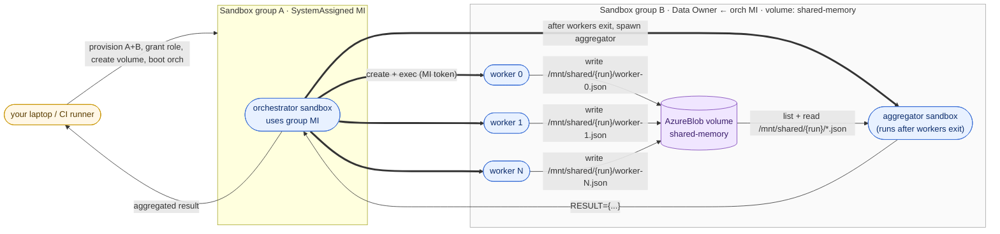
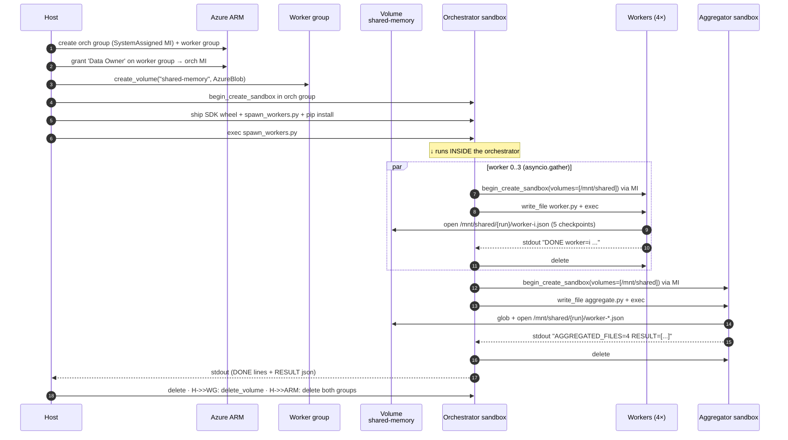

# 02 — Shared-blob memory swarm

Same cross-group inception shape as
[`01-sandbox-inception`](../01-sandbox-inception/) — an orchestrator
sandbox in Group A uses its group's managed identity to fan out N
workers in Group B — but with **one new piece**: the worker group owns
a single `AzureBlob` volume that every worker mounts and writes to.
After the workers are done and their sandboxes are deleted, the
orchestrator spawns one more sandbox in the worker group, mounts the
same volume read-only, and reads the durable scratchpad the workers
left behind.



## Where each piece of code runs

The demo is one file (`python/swarm.py`) but it executes across
three layers. Knowing which layer holds which identity is the key
to understanding the security boundary:

| Layer | Code | Where it runs | Identity it uses |
|---|---|---|---|
| **Host** | `main()`, group/role/volume setup, output parsing | Your laptop / CI runner | Your `az login` (`DefaultAzureCredential`) |
| **Orchestrator** | `SPAWN_WORKERS_SCRIPT` | Sandbox in **Group A** | Group A's **system-assigned MI** (used to call the SandboxGroup data plane on **Group B**) |
| **Workers** (×N) | `WORKER_PY` | Sandboxes in **Group B** | None — `open()` against a mounted path |
| **Aggregator** (×1) | `AGGREGATOR_PY` | Sandbox in **Group B**, started after workers exit | None — `glob` + `open()` against the same path |

The host runs *once* and never touches the volume. The orchestrator
runs *inside a sandbox* and only talks to the SandboxGroup data
plane (via MI). Workers and the aggregator are single-purpose
containers with no Azure credentials at all — the platform
brokers their access to shared storage via the mount.

## How a swarm run unfolds



For the general "what the volume primitive gives you vs. what
you'd build yourself" framing, see
[`guides/04-volumes`](../../../guides/04-volumes/).

## What makes this compelling

1. **Durable shared scratchpad** — checkpoints survive the workers
   that wrote them. A worker can be killed mid-run, restarted on a
   new sandbox, and resume from the last `worker-i.json`.
2. **Cross-worker visibility without RPC** — sibling agents see each
   other's partial state by listing a directory. No queue, no broker.
3. **Zero blob plumbing in agent code** — workers do
   `open("/mnt/shared/...", "w")`. No `azure-storage-blob`, no
   `BlobServiceClient`, no SAS, no connection strings, no
   `Storage Blob Data Contributor` to grant. The platform handles
   the storage account, container, and identity behind the volume.
4. **Same MI model as variant 01** — exactly one role assignment
   (`Container Apps SandboxGroup Data Owner` on the worker group →
   orchestrator MI). Nothing else.

## What each worker writes

Each worker checkpoints every 200,000 darts to a per-run, per-worker
file on the shared volume:

```text
/mnt/shared/
└── <run-id>/
    ├── worker-0.json
    ├── worker-1.json
    ├── worker-2.json
    └── worker-3.json
```

Each file is overwritten with the latest checkpoint:

```json
{
  "worker": 2,
  "inside": 785338,
  "total":  1000000,
  "checkpoints": [200000, 400000, 600000, 800000, 1000000],
  "done":   true
}
```

After all workers exit, the aggregator sandbox `glob`s
`/mnt/shared/<run-id>/worker-*.json`, parses each file, and prints
the aggregated payload — proving the data is still there once
*every* writer is gone.

## Run it

```bash
cd samples/sandboxes/scenarios/04-swarms/02-shared-blob-memory/python
pip install -r requirements.txt
python swarm.py
```

End-to-end run takes ~3–4 minutes (provision two groups, create
volume, boot orchestrator, install SDK, fan out 4 workers + 1
aggregator, tear everything down).

Expected output (last few lines):

```text
DONE worker=0 inside=785021 total=1000000 ckpts=5
DONE worker=1 inside=785338 total=1000000 ckpts=5
DONE worker=2 inside=786225 total=1000000 ckpts=5
DONE worker=3 inside=785203 total=1000000 ckpts=5
==> Aggregator sandbox read 4 checkpoint files from /mnt/shared/<run>/ AFTER all workers were deleted.
==> Aggregating across 4,000,000 darts...
    π ≈ 3.141787  (error 1.94e-04)
```

## How the shared state looks in agent code

Worker (no Azure SDK at all — just `open()`):

```python
path = f"/mnt/shared/{run_id}/worker-{i}.json"
with open(path + ".tmp", "w") as f:
    json.dump({"worker": i, "inside": inside, "total": k, "done": k == total}, f)
os.replace(path + ".tmp", path)
```

Aggregator (also just stdlib):

```python
for path in sorted(glob.glob(f"/mnt/shared/{run_id}/worker-*.json")):
    with open(path) as f:
        results.append(json.load(f))
```

## Production tips

- **Pick a `run_id` per swarm run** and namespace every blob under
  it. The example uses `uuid.uuid4().hex[:12]`. Re-running the same
  swarm against the same volume is then safe.
- **Atomic writes**: workers write to `worker-i.json.tmp` and
  `os.replace` it. The aggregator (or any sibling) only ever sees
  fully-written files.
- **Resumability**: a restarted worker can `open` its own
  `worker-i.json` and skip past the last checkpoint count before
  continuing — turning a fan-out swarm into a resumable swarm with
  no infrastructure changes.
- **Cleanup**: the host deletes the volume in the `finally:` block.
  In a real workflow you may want to keep it (one volume per
  long-running swarm) and just garbage-collect old `run_id/`
  prefixes on a schedule.

## Compared to variant 01

Variant 01 sends a single Pi estimate back from each worker via
stdout — workers cannot see each other and nothing about them
survives the run. Variant 02 keeps that orchestrator-driven inception
shape and adds a shared filesystem that *every* sandbox in the worker
group can read and write — turning a stateless fan-out into a
stateful multi-agent system.
