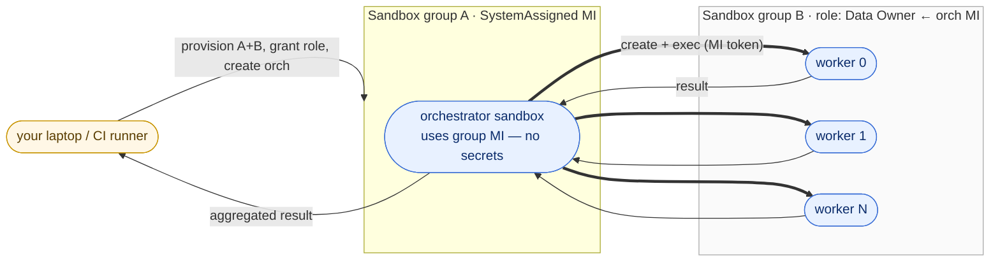

# 04 — Swarms

A *swarm* is one orchestrator coordinating many sandbox workers. The
interesting axis is **who the orchestrator is and how it dispatches**
— workers themselves are just sandboxes. This folder collects swarm
variants, each in its own numbered subfolder with the standard
`python/` + `cli/` split.



## Variants

| # | Folder | Orchestrator | Dispatch | Status |
|---|---|---|---|---|
| 01 | [`01-sandbox-inception`](01-sandbox-inception) | Sandbox in Group A | In-process `asyncio.gather` / bash `&` over `aca --managed-identity sandbox create` | ✅ ready |
| 02 | [`02-shared-blob-memory`](02-shared-blob-memory) | Sandbox in Group A | Same MI fan-out as 01, **plus a shared Azure Blob container** workers use as durable scratchpad / shared agent memory | ✅ ready |

## When to pick which

- **01-sandbox-inception** — self-contained agent swarms. The orchestrator
  is itself a sandbox, the dispatch logic is just `asyncio.gather` (or
  bash `&`), and there's no extra infrastructure to operate. Best
  starting point and the right shape when the orchestrator is *itself*
  an LLM agent that needs to spin up sub-agents on demand.
- **02-shared-blob-memory** — same identity-inception shape as 01,
  but with an Azure Blob container the orchestrator and every worker
  read and write through their managed identities. Right shape when
  workers must hand off partial results to siblings, when a
  half-finished work-item needs to survive a worker crash, or when
  the swarm acts as a multi-agent system whose "shared memory" lives
  on durable storage instead of in any one process.

Both variants share the same identity model: the orchestrator's
identity has `Container Apps SandboxGroup Data Owner` on the worker
group, and no credential is ever materialised inside an agent.

## Prerequisites

Run the baseline once — either flow works, both write the same
`samples/.env`:

```bash
cd ../../setup/python && pip install -r requirements.txt && python setup.py
# or
cd ../../setup/cli && ./setup.sh
```

Each variant's README has the per-variant run instructions.
