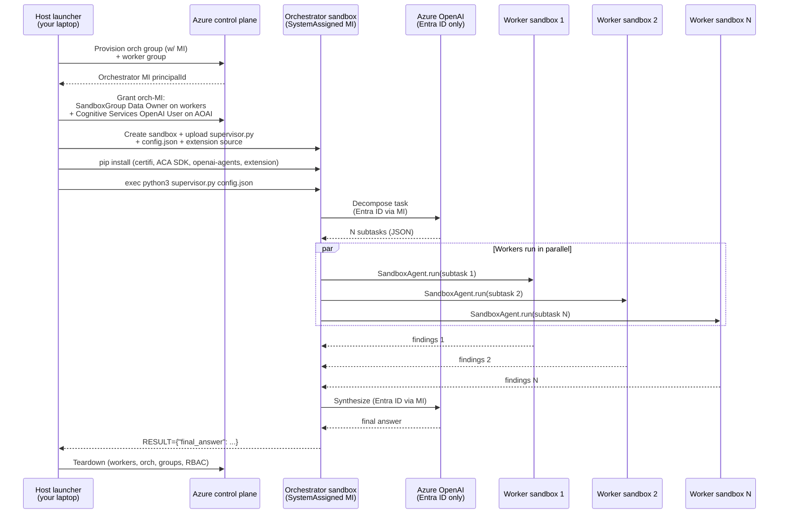

# 03 — Autonomous Swarm (harness IN compute, zero AOAI keys)

The third and most ambitious demo in this scenario. Implements OpenAI's
**"Harness IN Compute"** pattern: the agent harness itself runs inside an
ACA sandbox, not on the host. The host only does Azure control-plane
provisioning.

> **No API key, client secret, or user credential is ever passed into
> any sandbox.** All AOAI calls inside compute use Entra ID Managed Identity.

## Architecture



## What's zero-secret about it

| Compute layer | What it sees |
|---|---|
| Your laptop (host launcher) | `az login` user credential — control plane only, never passed in |
| Orchestrator sandbox | SystemAssigned MI; AOAI Entra Bearer fetched at runtime |
| Worker sandboxes | Shell + Filesystem only — no AOAI access, no credentials of any kind |
| Network path host→sandbox | Public endpoint with TLS; ACA SDK manages it |
| Network path sandbox→AOAI | TLS via the sandbox's **system CA bundle** (which trusts the ACA egress-proxy root CA that re-signs outbound HTTPS); Entra Bearer in `Authorization` header |

`env | grep -i key` inside any sandbox returns nothing AOAI-related.

> **TLS note.** ACA sandboxes route outbound HTTPS through an "ADC Egress
> Proxy" that re-signs server certs with a private CA. That CA is installed
> into the sandbox's system trust store at `/etc/ssl/certs/ca-certificates.crt`
> but **not** into Python's `certifi` bundle. The supervisor pins httpx and
> the OpenAI SDK to the system bundle so TLS verifies cleanly. If you fork
> this demo and use a different HTTP library, set `SSL_CERT_FILE` or pass
> `verify="/etc/ssl/certs/ca-certificates.crt"` explicitly — `certifi`
> alone will fail with `unable to get local issuer certificate`.

## Prerequisites

- **Azure subscription** with ACA Sandboxes preview enabled.
- **You are `Owner` or `User Access Administrator`** on the AOAI account
  (so the launcher can grant `Cognitive Services OpenAI User` to the
  per-run MI). If you only have `Cognitive Services OpenAI User` yourself,
  ask your sub admin to grant you `User Access Administrator` on the
  AOAI resource, or use a user-assigned identity granted once.
- **AOAI deployment** reachable from the sandbox over HTTPS 443. The TLS
  trust chain is handled via the sandbox's system CA bundle (see the
  TLS note above) — no extra cert-injection code is required.
- **`samples/.env` populated** at the repo root with `AZURE_OPENAI_ENDPOINT`,
  `AZURE_OPENAI_DEPLOYMENT`, `AZURE_OPENAI_API_VERSION`, `AZURE_OPENAI_RESOURCE_ID`
  (optional — auto-derived from endpoint if missing), `AZURE_SUBSCRIPTION_ID`
  (or alias `ACA_SUBSCRIPTION`), `ACA_RESOURCE_GROUP`, and
  `ACA_SANDBOXGROUP_REGION` (or alias `ACA_REGION`).

## Run modes

```powershell
# Just provision + upload + import-check (~60s). No AOAI calls.
python launcher.py --dry-run

# Provision + auth validation (acquires MI token in sandbox, calls /models,
# lists worker group sandboxes). ~3 min. No worker spawns, no LLM tokens.
python launcher.py --smoke-run

# Full run: decompose, fan out workers, synthesize.
python launcher.py --task "Compare the SandboxGroupClient async vs sync API surface" --workers 3

# Keep sandbox groups after the run (for debugging). The AOAI role
# assignment is ALWAYS cleaned up even with --keep, so the orchestrator MI
# never retains AOAI access after the launcher exits.
python launcher.py --task "..." --workers 3 --keep
```

## Expected wall time

- Group provisioning: ~60s × 2 (parallel)
- RBAC propagation: 30–120s
- Bootstrap inside orchestrator: ~60s
- Decompose call: ~5s
- Worker fan-out: ~60–120s per worker, parallel
- Synthesis: ~10s
- Teardown: ~30s

**Total: 5–8 min** for a 3-worker run, dominated by sandbox lifecycle.

## Troubleshooting

| Symptom | Likely cause | Fix |
|---|---|---|
| `403 PermissionDenied` from AOAI after RBAC | Propagation lag (supervisor already retries up to 5 min) | Re-run; first run after fresh role grants can take longer |
| Orchestrator group has no principalId | SystemAssigned MI didn't materialize | Re-run; rare control-plane race |
| `CERTIFICATE_VERIFY_FAILED` inside sandbox | AOAI is APIM-fronted with private CA | This demo doesn't support that path yet; use a direct AOAI endpoint |
| `Container Apps SandboxGroup Data Owner` not found at scope | Sub doesn't have ACA Sandboxes preview enabled | Enable preview, then re-run |
| `RoleAssignmentExists` | Re-running while previous run's MI still has the role | Safe — launcher skips and proceeds |

## What this proves vs `01` and `02`

| Demo | Where the agent loop runs | Secret posture |
|---|---|---|
| `01-deep-research-single` | Host process | API key in `samples/.env`, host process |
| `02-swarm-research-parallel` | Host process (drives N sandboxes) | API key in `samples/.env`, host process |
| **`03-autonomous-swarm` (this)** | **Inside orchestrator sandbox** | **Zero AOAI keys anywhere; only Entra ID** |

This is the demo that maps directly to OpenAI's
[Sandboxes guide → Harness IN Compute](https://developers.openai.com/api/docs/guides/agents/sandboxes)
architecture diagram, with the cherry on top of being credential-free.
