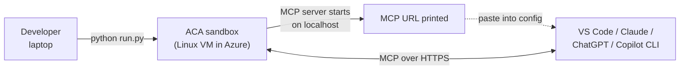

# 09-mcp-hosting — Host MCP servers in sandboxes

> **AI apps on Azure PaaS + serverless** — sandboxes pillar.

An [Azure Container Apps sandbox](https://learn.microsoft.com/azure/container-apps/sandbox)
is a great place to host a **Model Context Protocol (MCP)** server:
the server runs co-located with whatever it serves (a tool runtime, a
headless browser, a database, …), the sandbox provides per-session
isolation and a public address, and your AI client (VS Code Copilot
Chat, Claude Desktop, ChatGPT Connectors, this Copilot CLI) connects
to it over HTTPS.

This scenario collects **two complementary patterns**. They differ on
the exposure mechanism and on what's behind the MCP — together they
cover the two shapes most readers will need.

| Pattern | MCP server | Exposure | What it's for |
|---|---|---|---|
| **[excalidraw-anonymous](excalidraw-anonymous/)** | [`excalidraw-mcp`](https://github.com/excalidraw/excalidraw-mcp) on `:80` | `sandbox.add_port(80, anonymous=True)` → public `*.adcproxy.io/mcp` | The simplest possible "host an MCP server in Azure" demo. Public URL, no auth, no DB. Hand-drawn diagrams render inline in chat. |
| **[dab-sql-devtunnel](dab-sql-devtunnel/)** | [Data API Builder](https://learn.microsoft.com/azure/data-api-builder/mcp/overview) MCP server in front of PostgreSQL (Chinook sample DB) | [Microsoft Dev Tunnels](https://learn.microsoft.com/azure/developer/dev-tunnels/) — outbound only, **no inbound port on the sandbox** | The classic "give an agent typed access to a database" pattern. Auto-generated MCP CRUD tools, RBAC enforced by DAB, zero SQL written by anyone. |

## Common interaction shape

Both patterns end the same way:

1. The script prints an **MCP URL** and ready-to-paste config snippets.
2. You drop that URL into the MCP client of your choice.
3. You chat with your AI normally — the sandbox is invisible to you;
   new capabilities just appear.

The script also performs a real MCP `initialize` handshake against the
URL before declaring success, so you know the server is reachable
before you bother opening another tool.

## Pick a pattern

- **Start with `excalidraw-anonymous`** if you just want to see "an MCP
  server in a sandbox" work end-to-end. Five-minute path from `az
  login` to drawing diagrams in chat. No DB, no .NET, no tunnel, no
  login.
- **Use `dab-sql-devtunnel`** when you want the realistic
  "MCP-in-front-of-data" pattern, with **no inbound port exposed on
  the sandbox**. Heavier (Postgres + .NET + DAB + Dev Tunnels) and
  requires a one-time Microsoft/GitHub device-code login, but matches
  how you'd actually want to expose a private database to an agent.

## Prerequisites (both patterns)

1. An Azure subscription with the **Azure Container Apps sandbox**
   feature enabled. (See repo root [setup guide](../../setup/).)
2. Azure CLI logged in (`az login`).
3. Python 3.10+.
4. `samples/.env` written by `samples/sandboxes/setup/python/setup.py`.

The `dab-sql-devtunnel` pattern additionally needs a free Microsoft or
GitHub account for the one-time Dev Tunnels device-code sign-in.

## Verify it works (three tiers)

The patterns are built to be verifiable at three levels of fidelity,
so you can stop at whichever matches where you're working:

1. **The script itself** — does an MCP `initialize` over HTTPS and
   asserts on the `protocolVersion` + `serverInfo` shape. If `run.py`
   exits 0, the endpoint is real.
2. **This Copilot CLI session** — once the URL is printed, ask:
   > *"Register the MCP server at &lt;URL&gt; and list its tools."*

   Copilot CLI supports MCP via its config and the tools become
   callable from this terminal, no IDE switch.
3. **VS Code / Claude / ChatGPT** — each pattern's README has a
   copy-pasteable config snippet for the major clients.

## Status

| Pattern | Python SDK | `aca` CLI |
|---|---|---|
| `excalidraw-anonymous` | ✅ ready | 📝 planned |
| `dab-sql-devtunnel` | ✅ ready | 📝 planned |

## Composes with these guides

- [01 (sandboxes)](../../guides/01-sandboxes/README.md) — sandbox basics
- [02 (snapshots)](../../guides/02-snapshots/README.md) — save built MCP server state for fast resume
- [03 (disks)](../../guides/03-disks/README.md) — bake MCP server deps into a custom disk
- [05 (lifecycle)](../../guides/05-lifecycle/README.md) — auto-suspend idle MCP sandboxes
- [06 (ports)](../../guides/06-ports/README.md) — Entra-gated vs anonymous exposure
- [08 (egress)](../../guides/08-egress/README.md) — lock down outbound network
- [11 (labels)](../../guides/11-labels/README.md) — one MCP sandbox per user / per session
