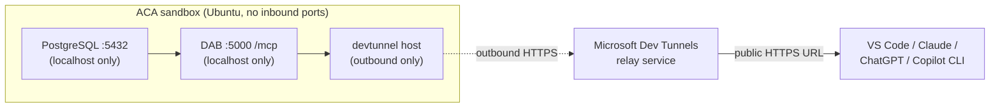

# dab-sql-devtunnel — Database → MCP, no inbound port on the sandbox

Run **PostgreSQL + the Chinook sample database + the Data API Builder
(DAB) SQL MCP Server** all inside one Azure Container Apps sandbox, and
expose the MCP endpoint to the public internet via **Microsoft Dev
Tunnels** — so the sandbox itself never opens an inbound port.

> Part of [scenarios/09-mcp-hosting](../README.md). See the sibling
> pattern [`excalidraw-anonymous`](../excalidraw-anonymous/) for the
> simpler "just `add_port`" exposure model.

## Why this pattern

This is the classic AI-app shape: **an agent needs typed,
RBAC-controlled access to a database** without anyone writing SQL or
glue code, and without exposing the database to the public internet.

- [Data API Builder](https://learn.microsoft.com/azure/data-api-builder/)
  introspects your DB schema and exposes **generic CRUD MCP tools**
  (`describe_entities`, `read_records`, `create_record`,
  `update_record`, `delete_record`, `execute_entity`) that take an
  entity name as a parameter. The agent calls `describe_entities`
  first to discover what's available, then `read_records` with OData
  filters/sort/paging to answer questions.
- DAB enforces RBAC per role per entity. The agent literally cannot
  call operations the config doesn't grant — this demo is read-only
  for the `anonymous` role.
- DAB deliberately does **not** do NL2SQL. The agent's tools are
  deterministic, parameterized, and auditable.

And by using Dev Tunnels for exposure:

- The sandbox has **zero inbound ports open**.
- Postgres and DAB both bind to `localhost` — unreachable from
  anywhere except via the outbound tunnel.
- Dev Tunnels handles HTTPS termination and gives you a stable public
  URL (e.g. `https://<id>-5000.usw2.devtunnels.ms`).

## Architecture



## Prerequisites

1. An Azure subscription with the **Azure Container Apps sandbox**
   feature enabled. (See repo root [setup guide](../../../setup/).)
2. Azure CLI logged in (`az login`) — the script uses
   `DefaultAzureCredential` to authenticate to the sandbox group.
3. Python 3.10+.
4. `samples/.env` written by `samples/sandboxes/setup/python/setup.py`
   (subscription, resource group, sandbox group, region).
5. A free Microsoft or GitHub account for the **one-time Dev Tunnels
   device-code login** (see below).

## Run it

```bash
cd python
pip install -r requirements.txt
python run.py
```

Total runtime: ~3 minutes for the automated steps, plus however long
the device-code login takes you. The script will print exactly what to
do at each step.

## What the script does

1. Creates a sandbox on the `ubuntu` disk (`2 CPU / 4 GiB`), labeled
   `{"scenario":"mcp-hosting","pattern":"dab-sql-devtunnel"}`.
2. Installs and starts PostgreSQL inside the sandbox (no `systemd`, so
   `pg_ctlcluster`); creates a `dab` superuser.
3. Downloads the [Chinook PostgreSQL script](https://github.com/lerocha/chinook-database)
   and loads it (~11 tables, ~80 KB seed: artists, albums, tracks,
   customers, invoices, employees, playlists, …).
4. Installs the .NET 8 SDK via the official `dotnet-install.sh`.
5. Installs DAB as a global .NET tool (`Microsoft.DataApiBuilder`,
   version-pinned).
6. Uploads [`app/dab-config.json`](app/dab-config.json) into the
   sandbox at `/app/dab-config.json`.
7. Starts `dab start` on port `5000` as a background process; verifies
   MCP `initialize` against `http://localhost:5000/mcp`.
8. Downloads the `devtunnel` CLI binary directly
   (`https://aka.ms/TunnelsCliDownload/linux-x64`).
9. **Pauses for a one-time interactive login** — prints the device-code
   instructions and waits for you to complete sign-in in a browser. The
   token is cached inside the sandbox for the rest of the run.
   (See "About Dev Tunnels login" below.)
10. Runs `devtunnel host -p 5000 --allow-anonymous` in the background,
    parses the public URL from its stdout, and verifies the public MCP
    `initialize` handshake from your laptop.
11. Prints copy-pasteable config snippets for the major MCP clients.
12. Waits for you to press Enter, then tears everything down.

## About the DAB config

[`app/dab-config.json`](app/dab-config.json):

- Points DAB at local Postgres on `localhost:5432`.
- Enables MCP at `/mcp`, REST at `/api`, GraphQL at `/graphql`.
- Sets `authentication.provider: "StaticWebApps"` — with no
  `X-MS-CLIENT-PRINCIPAL` header on incoming requests (which is what
  the Dev Tunnels relay sends), DAB treats the caller as the
  **`anonymous` role**. This is the right knob for "MCP without auth"
  in DAB today.
- Disables write tools globally via `runtime.mcp.dml-tools`
  (`create-record`, `update-record`, `delete-record` all `false`).
- Defines 11 read-only entities (`Artist`, `Album`, `Track`, `Genre`,
  `MediaType`, `Customer`, `Employee`, `Invoice`, `InvoiceLine`,
  `Playlist`, `PlaylistTrack`), each granting `anonymous` the `read`
  action only.

The `dab/dab` Postgres password in the connection string is intentional
for this sandbox-local demo: Postgres binds to `localhost` only, the
sandbox is ephemeral, and the credential never leaves the sandbox.
**Do not copy this pattern for any non-demo deployment** — use a managed
identity or Key Vault reference instead.

## About Dev Tunnels login

`devtunnel host` requires the **host process** to be authenticated,
even when `--allow-anonymous` lets consumers connect without auth.
There's no browser inside the sandbox, so the script triggers the
device-code flow:

```
========================================================================
ACTION REQUIRED — Dev Tunnels device-code login
========================================================================
  1. Open: https://login.microsoft.com/device
  2. Enter the code shown in the sandbox: code <YOUR-CODE>
  3. Sign in with any Microsoft / GitHub account.
========================================================================
```

Sign in with any free Microsoft or GitHub account. The token is cached
inside the sandbox at `~/.devtunnels/` for the rest of the run; tearing
down the sandbox discards it.

You have 15 minutes to complete the sign-in before the script gives up.

## What you can do with it

Once the MCP URL is registered in your client, ask your agent in
normal chat:

- *"Who are the top 5 customers by total invoice amount?"*
- *"What's the average track length per genre? Show as a table."*
- *"Which albums by AC/DC are in the catalog?"*
- *"How many invoices were issued in Brazil in 2024?"*
- *"What media types exist and how many tracks of each?"*

The agent calls `describe_entities` to discover the schema, then
`read_records` with OData filters/sort/paging to answer. **No SQL is
written by anyone** — schema, types, filters, and permissions all
flow from `dab-config.json`.

## Use it from your MCP client

### From VS Code Copilot Chat

Add to `.vscode/mcp.json` in your repo (or your user-level mcp.json):

```json
{
  "servers": {
    "chinook": {
      "type": "http",
      "url": "https://<tunnel-id>-5000.<region>.devtunnels.ms/mcp"
    }
  }
}
```

Reload the MCP servers in Copilot Chat → the DAB tools appear in the
tool picker.

### From this Copilot CLI session

After the URL is printed, ask:

> "Register the MCP server at `<URL>` as `chinook`, list its tools,
> then ask: who are the top 5 customers by spend?"

### From Claude Desktop / ChatGPT

Settings → Connectors → Add custom connector → paste the URL.

### Inspect the tool catalog interactively

```bash
npx -y @modelcontextprotocol/inspector <URL>
```

Opens a browser UI listing every tool DAB exposes, with full input
schemas — great for confirming permissions landed the way you
configured them.

## Cleanup

The script tears down the sandbox automatically when you press Enter
at the final prompt (or on any error). To manually clean up any
leftover sandboxes from interrupted runs:

```bash
python -c "from azure.identity import DefaultAzureCredential; from azure.containerapps.sandbox import SandboxGroupClient, endpoint_for_region; from pathlib import Path; env={l.split('=',1)[0].strip():l.split('=',1)[1].strip() for l in Path('samples/.env').read_text().splitlines() if '=' in l and not l.startswith('#')}; c=SandboxGroupClient(credential=DefaultAzureCredential(), endpoint=endpoint_for_region(env['ACA_SANDBOXGROUP_REGION']), subscription_id=env['AZURE_SUBSCRIPTION_ID'], resource_group=env['ACA_RESOURCE_GROUP'], sandbox_group=env['ACA_SANDBOX_GROUP']); [c.delete_sandbox(s.id) for s in c.list_sandboxes() if (getattr(s,'labels',None) or {}).get('pattern')=='dab-sql-devtunnel']"
```

## Production hardening tips

- **For production, use Azure Relay Hybrid Connections instead of Dev
  Tunnels.** Dev Tunnels is purpose-built for ephemeral dev/test
  workflows. For a durable production deployment with the same
  outbound-only exposure property, install the
  [Hybrid Connection Manager](https://learn.microsoft.com/azure/app-service/app-service-hybrid-connections)
  in the sandbox, point it at `localhost:5000`, and have consumers
  reach it through the Relay namespace.
- **Don't expose write tools anonymously.** This demo is read-only on
  purpose. If you allow writes, gate the tunnel on Entra (`devtunnel
  host ... --allow-tenant <tenant>`) and use a non-anonymous DAB
  authentication provider
  ([docs](https://learn.microsoft.com/azure/data-api-builder/authentication)).
- **Bake the disk.** [Guide 03 (disks)](../../../guides/03-disks/README.md)
  — pre-install Postgres + .NET + DAB + devtunnel onto a custom disk so
  cold start is "boot the DB" instead of "install everything."
- **Snapshot with seed data.** [Guide 02 (snapshots)](../../../guides/02-snapshots/README.md)
  — snapshot after Chinook is loaded; each restored sandbox starts with
  a fresh, identical DB in ~1s.
- **Auto-suspend.** [Guide 05 (lifecycle)](../../../guides/05-lifecycle/README.md)
  — idle MCP sandboxes shouldn't burn quota; suspend on inactivity and
  resume on the next request.
- **Lock down egress.** [Guide 08 (egress)](../../../guides/08-egress/README.md)
  — set `set_egress_default("Deny")` and allow only the hosts the
  pattern needs:

  | Host | Why |
  |---|---|
  | `*.devtunnels.ms` | Dev Tunnels relay traffic |
  | `global.rel.tunnels.api.visualstudio.com` | Dev Tunnels control plane |
  | `login.microsoftonline.com` | Device-code login + token refresh |
  | `aka.ms`, `*.azureedge.net` | Dev Tunnels installer |
  | `packages.microsoft.com`, `dot.net` | .NET install |
  | `*.nuget.org` | DAB tool install |
  | `raw.githubusercontent.com` | Chinook SQL download (one-time) |

  …plus your own DB's outbound needs if any.
- **Bring your own DB.** Replace the Chinook seed with your schema and
  edit the `entities` block in `dab-config.json`. Restart `dab start`
  inside the sandbox to pick up the new config. Same outcome, your
  data, your RBAC. For non-demo deployments, replace the
  `connection-string` with a managed-identity reference per
  [DAB managed-identity docs](https://learn.microsoft.com/azure/data-api-builder/authentication-azure-ad).

## Layout

```
dab-sql-devtunnel/
├── README.md                  ← this file
├── app/
│   └── dab-config.json        ← uploaded into the sandbox
└── python/
    ├── README.md
    ├── requirements.txt
    └── run.py
```
