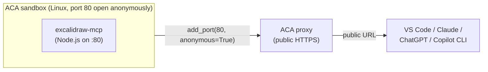

# excalidraw-anonymous — public MCP server in a sandbox

Host [`excalidraw-mcp`](https://github.com/excalidraw/excalidraw-mcp)
inside an Azure Container Apps sandbox and expose it at a public,
anonymous HTTPS URL using `add_port`. Connect from VS Code Copilot
Chat, Claude Desktop, ChatGPT Connectors, or this Copilot CLI — ask
your agent to draw a diagram and it renders inline in chat as a
hand-drawn whiteboard.

> Part of [scenarios/09-mcp-hosting](../README.md). See the sibling
> pattern [`dab-sql-devtunnel`](../dab-sql-devtunnel/) for the
> no-inbound-port variant that puts a database behind MCP.

## Why this pattern

This is the **simplest possible "MCP server in Azure" demo**. There is
no database, no .NET, no tunnel, and no login — just a Node.js MCP
server, one open port, and a public URL. It's the right pattern when:

- The MCP server is **self-contained** (no DB, no secrets).
- It's **OK to be public** (anonymous read/write to *this server's*
  in-memory state — Excalidraw stores its scene in the sandbox).
- You want a **5-minute end-to-end demo** of MCP-in-a-sandbox without
  any extra moving parts.

## Architecture



## Prerequisites

1. An Azure subscription with the **Azure Container Apps sandbox**
   feature enabled. (See repo root [setup guide](../../../setup/).)
2. Azure CLI logged in (`az login`) — the script uses
   `DefaultAzureCredential` to authenticate to the sandbox group.
3. Python 3.10+.
4. `samples/.env` written by `samples/sandboxes/setup/python/setup.py`
   (subscription, resource group, sandbox group, region).

No browser sign-in, no service accounts, no extra secrets.

## Run it

```bash
cd python
pip install -r requirements.txt
python run.py
```

Total runtime: ~2 minutes. The script prints the public MCP URL and
waits for you to press Enter before tearing the sandbox down.

## What the script does

1. Creates a sandbox on the `copilot` disk (`copilot` ships with a
   modern Node toolchain, which `excalidraw-mcp` requires), labeled
   `{"scenario":"mcp-hosting","pattern":"excalidraw-anonymous"}`.
2. Clones `excalidraw-mcp` from GitHub inside the sandbox.
3. Runs `npm install` and `npm run build`.
4. Starts the server on port `80` as a background process.
5. Polls in-sandbox readiness on `POST /mcp` with an MCP `initialize`
   request — no `sleep N` guesses.
6. Calls `sandbox.add_port(80, anonymous=True)` → public URL like
   `https://<sandbox-id>--80.<region>.adcproxy.io/mcp`.
7. Verifies the public URL with a real MCP `initialize` handshake
   over HTTPS from your laptop.
8. Prints copy-pasteable config snippets for the major MCP clients.
9. Waits for you to press Enter, then tears everything down.

## Exposed MCP tools

Once registered, the server offers:

| Tool | Purpose |
|---|---|
| `read_me` | Returns the Excalidraw element format reference with color palettes and examples. **Call this first** before drawing. |
| `create_view` | Renders a hand-drawn diagram from a JSON array of Excalidraw elements; elements stream in with draw-on animations. |
| `export_to_excalidraw` | Uploads the current diagram to excalidraw.com and returns a shareable URL. |
| `save_checkpoint` / `read_checkpoint` | Persist/restore the canvas state by id. |

## What you can do with it

Once the URL is in your MCP client, ask your agent in normal chat:

- *"Draw an architecture diagram of a 3-tier web app with a load
  balancer, two app servers, and a Postgres database."*
- *"Add a Redis cache between the app tier and the DB."*
- *"Sketch the request flow for a JWT auth handshake."*
- *"Export the current scene to excalidraw.com so I can share it."*

The diagram renders inline in chat. State persists in the sandbox —
restart your IDE and the scene is still there until you tear the
sandbox down.

## Use it from your MCP client

### From VS Code Copilot Chat

Add to `.vscode/mcp.json` in your repo (or your user-level mcp.json):

```json
{
  "servers": {
    "excalidraw": {
      "type": "http",
      "url": "https://<sandbox-id>--80.<region>.adcproxy.io/mcp"
    }
  }
}
```

Reload the MCP servers in Copilot Chat → the Excalidraw tools appear
in the tool picker.

### From this Copilot CLI session

After the URL is printed, ask:

> "Register the MCP server at `<URL>` for this session, list its tools,
> then call `create_view` to draw a hello-world rectangle."

### From Claude Desktop / ChatGPT

Settings → Connectors → Add custom connector → paste the URL.

### Inspect the tool catalog interactively

```bash
npx -y @modelcontextprotocol/inspector <URL>
```

## Security notes

**Anonymous = open to the internet.** Anyone with the URL can draw on
your board and consume its memory. That's fine for an ephemeral demo
where you can tear it down in a minute, but **do not use this exposure
pattern** for:

- MCP servers that talk to a database or secrets.
- Long-running production deployments.
- Anything tied to a customer or tenant.

For tenant-gated exposure use `add_port(80, email=...)` (Entra-gated)
or front the sandbox with API Management / your own auth proxy. See
[guide 06 (ports)](../../../guides/06-ports/README.md).

## Cleanup

The script tears down the sandbox automatically when you press Enter
at the final prompt (or on any error). To manually clean up any
leftover sandboxes from interrupted runs:

```bash
python -c "from azure.identity import DefaultAzureCredential; from azure.containerapps.sandbox import SandboxGroupClient, endpoint_for_region; from pathlib import Path; env={l.split('=',1)[0].strip():l.split('=',1)[1].strip() for l in Path('samples/.env').read_text().splitlines() if '=' in l and not l.startswith('#')}; c=SandboxGroupClient(credential=DefaultAzureCredential(), endpoint=endpoint_for_region(env['ACA_SANDBOXGROUP_REGION']), subscription_id=env['AZURE_SUBSCRIPTION_ID'], resource_group=env['ACA_RESOURCE_GROUP'], sandbox_group=env['ACA_SANDBOX_GROUP']); [c.delete_sandbox(s.id) for s in c.list_sandboxes() if (getattr(s,'labels',None) or {}).get('pattern')=='excalidraw-anonymous']"
```

## Production hardening tips

- **Bake the disk.** [Guide 03 (disks)](../../../guides/03-disks/README.md)
  — pre-install Node + a built `excalidraw-mcp` so each cold start
  skips `npm install` and `npm run build` (~90s saved).
- **Snapshot post-build.** [Guide 02 (snapshots)](../../../guides/02-snapshots/README.md)
  — resume into a fully built MCP server in ~1s.
- **Auto-suspend.** [Guide 05 (lifecycle)](../../../guides/05-lifecycle/README.md)
  — idle MCP sandboxes shouldn't burn quota; suspend on inactivity and
  resume on the next request.
- **One sandbox per user.** [Guide 11 (labels)](../../../guides/11-labels/README.md)
  — tag with `{"user": "alice@..."}` and look up with
  `list_sandboxes(labels=...)` so each user gets their own drawing
  surface.
- **Move to Entra-gated exposure** for anything beyond a demo:
  `add_port(80, email="alice@contoso.com")`.

## Layout

```
excalidraw-anonymous/
├── README.md           ← this file
└── python/
    ├── README.md
    ├── requirements.txt
    └── run.py
```
