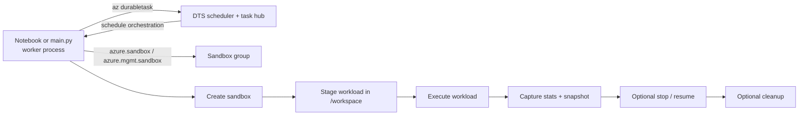

# Durable Task Workflows + Sandbox Jobs

Use this lab to orchestrate Azure Container Apps sandbox jobs with Durable Task Scheduler (DTS) from Python.

This is a **DTS + sandboxes** lab only:

- the Durable Task worker runs **outside** the sandbox in your notebook kernel or `main.py` process
- DTS infrastructure is created with the official `az durabletask` CLI extension
- sandbox lifecycle work is done through the sandbox SDK clients
- `durabletask-azuremanaged` remains an **optional lab dependency**, separate from the core sandbox SDK packages

## What you'll do

In this lab you will:

1. Provision a DTS scheduler and task hub
2. Start a Durable Task worker in your local Python process
3. Run a primary sandbox lifecycle orchestration
4. Optionally run a small fan-out sample with parallel sandbox jobs
5. Inspect results in the Durable Task dashboard
6. Clean up the sandboxes and DTS resources when you are finished

## Lab flow



## Files in this lab

| File | Purpose |
|------|---------|
| `01-orchestrate-sandbox-jobs.ipynb` | Recommended walkthrough-first lab experience |
| `main.py` | Script mirror for a quick end-to-end run |
| `README.md` | Lab overview, setup, and cleanup guidance |

## Prerequisites

- Azure subscription with permission to create resource groups, DTS resources, and sandbox resources
- Azure CLI signed in with `az login`
- VS Code with the Jupyter extension if you want the notebook-first experience
- Python environment with the sandbox SDKs installed

### Install the Python packages

Install the sandbox SDKs first, then add DTS separately:

```powershell
pip install azure-sandbox azure-mgmt-sandbox
pip install durabletask-azuremanaged
```

### Or install sandbox wheels from a GitHub Release

If you want to validate against release wheels from this repo, install those first and then add DTS separately.

GitHub CLI is required for this flow: `gh auth status`

```powershell
$wheelDir = Join-Path (Get-Location) '.artifacts\release-wheels'
New-Item -ItemType Directory -Force -Path $wheelDir | Out-Null

gh release download <tag> --repo Azure-Samples/azure-container-apps-sandboxes --pattern 'azure_sandbox-*.whl' --dir $wheelDir
gh release download <tag> --repo Azure-Samples/azure-container-apps-sandboxes --pattern 'azure_mgmt_sandbox-*.whl' --dir $wheelDir

$sdkWheels = Get-ChildItem "$wheelDir\azure_sandbox-*.whl", "$wheelDir\azure_mgmt_sandbox-*.whl" | ForEach-Object FullName
pip install @sdkWheels
pip install durabletask-azuremanaged
```

### Notes

- `main.py` can also load sandbox wheels from `vendor\wheels` as a local fallback if that folder exists
- the lab provisions the official `durabletask` Azure CLI extension automatically, but you can install it up front with:

  ```powershell
  az extension add --name durabletask
  ```

- if your notebook kernel or managed environment cannot find Azure CLI on Windows, restart VS Code or set `AZURE_CLI_PATH` to your Azure CLI executable, for example:

  ```text
  C:\Program Files (x86)\Microsoft SDKs\Azure\CLI2\wbin\az.cmd
  ```

## Get started

### Option 1: Run the notebook (recommended)

Open `01-orchestrate-sandbox-jobs.ipynb` in VS Code and run the cells top to bottom.

The notebook walks through:

1. provisioning the resource group, scheduler, and task hub
2. starting the worker in the notebook kernel
3. running the primary orchestration
4. running the optional fan-out sample
5. opening the dashboard with the printed endpoint and task hub values
6. stopping the worker and cleaning up

> Important: the notebook exposes cleanup flags in cell 0. Review them before you run the destructive cleanup step. The sample values in that setup cell can enable sandbox, sandbox-group, and DTS cleanup for you.

### Option 2: Run the script

For a fast end-to-end run:

```powershell
python .\labs\02-durable-task-workflows\main.py --assign-current-user-role --stop-and-resume
```

Useful flags:

```powershell
python .\labs\02-durable-task-workflows\main.py `
  --assign-current-user-role `
  --stop-and-resume `
  --cleanup-sandboxes `
  --fan-out-width 2
```

You can also provision DTS resources without starting the worker:

```powershell
python .\labs\02-durable-task-workflows\main.py --provision-only
```

## What the workflow does

The primary orchestration runs one sandbox lifecycle end to end:

1. Ensure the sandbox group exists
2. Create a sandbox
3. Write a small workload into `/workspace`
4. Execute the workload
5. Capture output and sandbox stats
6. Create a snapshot
7. Optionally stop and resume the sandbox
8. Optionally delete the sandbox

Unless you pass `--skip-fan-out`, the script also runs a small fan-out sample that starts multiple sandbox jobs in parallel.

## CLI boundary in this lab

This lab intentionally keeps the DTS and sandbox control planes separate:

| Job | CLI to use | Typical commands |
|---|---|---|
| Create, show, wait on, or delete DTS schedulers and task hubs | Official `az durabletask` extension | `az durabletask scheduler create ...`<br>`az durabletask taskhub create ...` |
| Manage sandbox groups, sandboxes, files, ports, snapshots, images, volumes, and secrets | `az sandbox` | `az sandboxgroup create ...`<br>`az sandbox snapshot list ...` |

## Expected output

After provisioning and running the workflows, the lab prints:

- DTS endpoint
- task hub name
- dashboard URL: `https://dashboard.durabletask.io/`
- workflow results for the primary orchestration
- optional fan-out results

If the worker process cannot connect to DTS, grant your signed-in identity the **Durable Task Data Contributor** role on the scheduler or task hub. The script can try to assign that role with `--assign-current-user-role`, but your identity still needs permission to create role assignments.

## Cleanup

Cleanup is intentionally explicit in the script and controlled by notebook flags in the walkthrough.

- `--cleanup-sandboxes` deletes each sandbox from inside the workflow
- `--delete-sandbox-group` removes the sandbox group after the run
- `--delete-dts` deletes the task hub and scheduler after the run
- `--delete-resource-group` deletes the entire resource group

If you leave cleanup disabled, you can inspect orchestration history in the DTS dashboard and revisit the sandboxes manually before deleting anything.
