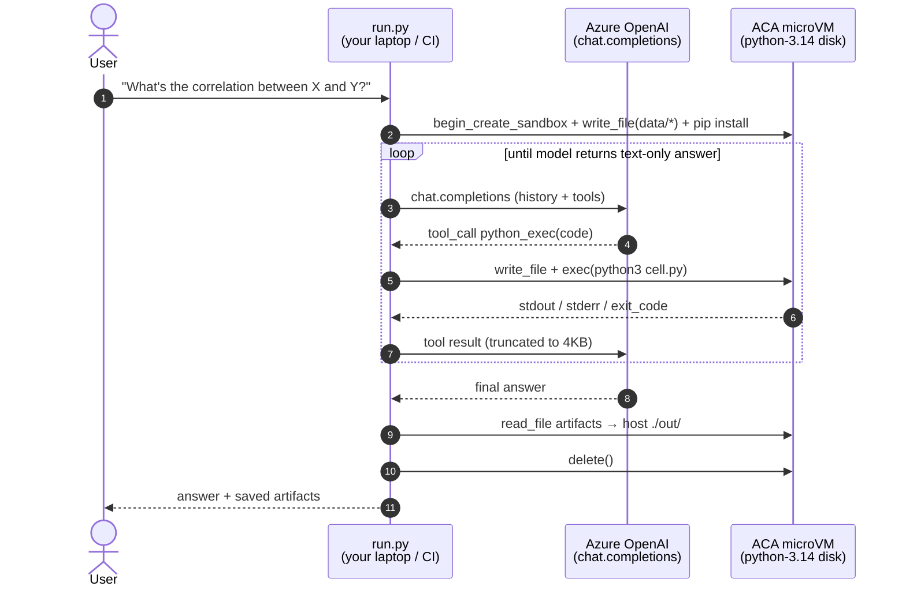

# 03-code-interpreter — LLM-driven Python execution in a sandbox

Generate code, run it in a sandbox, observe stdout/stderr, feed the
result back to the model, iterate. The same multi-turn loop that
**OpenAI's Code Interpreter** and **Claude's Code Execution** ship,
on your own infrastructure:

- **Your sandbox.** Every session is a fresh
  [ACA microVM](https://learn.microsoft.com/azure/container-apps/sandbox),
  spun up on demand and gone when the script returns.
- **Your data.** The data file you analyse is uploaded into that microVM;
  nothing about it is sent to the model except the snippets the model's
  code prints. There is no vendor file-upload bucket in the loop.
- **Your egress.** Pair with
  [`guides/08-egress`](../../guides/08-egress) and the analytic code can
  run with **zero** outbound network, even if the prompt is hostile.
- **Any Python library.** `pip install` whatever you need —
  pandas, polars, scikit-learn, duckdb, the new GA hotness. No vendor
  allowlist, no missing-package surprises.

Composes [`guides/01-sandboxes`](../../guides/01-sandboxes) (boot + exec)
and [`guides/07-files`](../../guides/07-files) (write_file/read_file for
data staging and artifact retrieval).

## Pattern



## Provider variants

| Folder | Provider | Notes |
|---|---|---|
| [`openai/`](openai/) | Azure OpenAI (chat completions + tool calling) | ✅ ready — uses raw `chat.completions.create` so it works against any AOAI deployment that supports tools. |
| `anthropic/` _(planned)_ | Anthropic Claude (Messages API tool use) | Same shape with the Anthropic SDK. |

## When to pick which compute model

| You want… | Use this | Not this |
|---|---|---|
| LLM analysing **your** data (BYO data file, BYO prompt) | **This scenario** | OpenAI Code Interpreter (uploads files into their tenant) |
| LLM running shell + filesystem **agent loops** (multi-step coding) | [`08-sandbox-agents/openai`](../08-sandbox-agents/openai) (Agents SDK + provider package) | This scenario (only one cell at a time, no agent framework) |
| A coding-agent CLI binary (`copilot`, `claude`, `codex`) running end-to-end | [`02-coding-agents`](../02-coding-agents) | This scenario |

The line is "**who drives the loop**":

- **02-coding-agents** — the CLI binary inside the sandbox drives it.
- **03-code-interpreter** _(this)_ — your harness drives it, one `python_exec` tool call at a time, no Agents SDK abstraction.
- **08-sandbox-agents** — the Agents SDK drives it, the sandbox is wired in as a provider.

## Run it

```bash
cd openai/python
pip install -r requirements.txt

# Default prompt: analyse the bundled sales.csv
python run.py

# Or supply your own
python run.py "What month had the highest revenue per dollar of marketing spend, per channel?"
```

The harness will print each model turn (which tool was called, head of
stdout, exit code), download any matplotlib charts the model saved
to `/workspace/out/` into `./out/`, then tear the sandbox down.

## Production tips

- **Deny-default egress.** The model can ship arbitrary Python into your
  sandbox — including `urllib.request.urlopen("attacker.com")`.
  [`guides/08-egress`](../../guides/08-egress) makes that a no-op:
  `set_egress_default("Deny")` plus host allows for whatever you actually
  need (e.g., `pypi.org` if you want the model to `pip install` more
  packages mid-session).
- **Bake the disk.** First boot installs pandas + matplotlib (~120 MB).
  Snapshot post-install ([`guides/02-snapshots`](../../guides/02-snapshots))
  or commit to a custom disk image
  ([`guides/03-disks`](../../guides/03-disks)) and you're down to
  ~10 s cold starts.
- **One sandbox per user / per session.** Tag with `labels=`
  ([`guides/11-labels`](../../guides/11-labels)) and look up active
  sessions with `list_sandboxes(labels=...)`. A janitor job can reap
  anything older than N hours.
- **Auto-suspend.** Idle code-interpreter sessions burn CPU minutes for
  nothing. Set `AutoSuspendPolicy(idle_timeout="5m")` (see
  [`guides/05-lifecycle`](../../guides/05-lifecycle)) so suspended
  sandboxes don't bill while the human reads the answer.
- **Cap the loop.** `run.py` defaults to `max_turns=20`. A pathological
  prompt can otherwise spend 50+ model calls re-running the same code.
- **Don't forward the model's API key into the sandbox.** This sample
  doesn't — the AOAI key lives in the harness, not in the sandbox env.
  Keep it that way: the sandbox is the *tool runtime*, not the
  *model client*.
- **Truncate tool output.** A `df.to_string()` on a million rows will
  blow your context window. `run.py` truncates each tool result at 4 KB
  — adjust to your model's window if you give it bigger snippets.

## What this is not

- Not a multi-tenant code-interpreter SaaS. One sandbox group per run is
  fine for a developer's laptop; for a customer-facing service, pair
  with the labels / lifecycle / egress patterns above and put it behind
  an auth layer that owns the per-tenant sandbox group selection.
- Not a streaming UI. `chat.completions.create` is used in
  request/response mode for simplicity; for a real product, switch to
  the streaming variant and forward deltas to the user.
- Not a code editor. The model can't edit files — it only emits
  full-file Python via `python_exec`. If you want long-running stateful
  notebooks, use [`08-sandbox-agents/openai`](../08-sandbox-agents/openai)
  instead.
