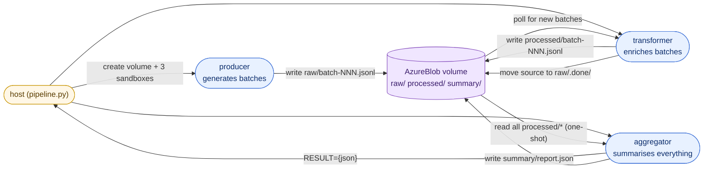
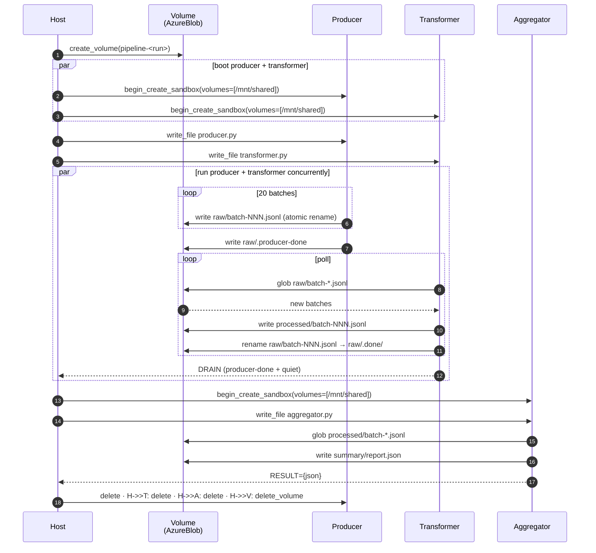

# 05-data-processing — Producer/consumer pipelines on a shared volume

A real ETL pipeline that streams events through three independent
sandboxes — **producer**, **transformer**, **aggregator** — coordinating
through a single shared **AzureBlob volume**. Every worker is plain
stdlib (`open()`, `glob`, `json`). No Azure Blob SDK, no SAS tokens, no
connection strings, no inter-sandbox network paths.

Composes [`guides/04-volumes`](../../guides/04-volumes) (shared
AzureBlob volume mounts) and [`guides/01-sandboxes`](../../guides/01-sandboxes)
(boot + exec).

## Architecture



## What runs where

| Layer | Code | Where it runs | Identity it uses |
|---|---|---|---|
| Host | [`python/pipeline.py`](python/pipeline.py) | Your laptop / CI runner | Your `az login` (`DefaultAzureCredential`) |
| Producer | [`python/workers/producer.py`](python/workers/producer.py) | One sandbox, runs ~10 s | None — pure `open()` against the mount |
| Transformer | [`python/workers/transformer.py`](python/workers/transformer.py) | Second sandbox, runs **concurrently** with the producer | None — pure `open()` + `glob` against the mount |
| Aggregator | [`python/workers/aggregator.py`](python/workers/aggregator.py) | Third sandbox, runs **after** producer + transformer drain | None — pure `open()` + `glob` |

The host runs once and never touches the volume. The three workers each
mount the same volume at `/mnt/shared` and coordinate through directory
conventions:

```text
/mnt/shared/
├── raw/
│   ├── batch-000.jsonl          ← producer writes here
│   ├── batch-001.jsonl
│   ├── ...
│   ├── .producer-done           ← producer drops this when finished
│   └── .done/
│       ├── batch-000.jsonl      ← transformer moves consumed batches here
│       ├── ...
├── processed/
│   ├── batch-000.jsonl          ← transformer writes enriched events
│   ├── ...
└── summary/
    └── report.json              ← aggregator writes the final summary
```

## How a pipeline run unfolds



## Why this is interesting

1. **Stream-while-process.** The producer writes batches while the
   transformer drains them; the pipeline is bottlenecked by the slower
   of the two, not by their sum. This is the canonical shape that lets
   real ETL keep up with the input rate.
2. **Atomic writes** (`write tmp + os.replace`) and a **`.done/`
   archive** mean a consumer can list `raw/batch-*.jsonl` at any time
   and never see a partial file or re-process one twice — without a
   queue or a broker.
3. **Stateless workers.** Restart the transformer in the middle of a
   run and it resumes from whatever's still in `raw/`. The state lives
   in the volume, not in any worker process.
4. **Zero blob plumbing.** Workers don't import `azure.storage.blob`,
   don't hold connection strings, and don't need
   `Storage Blob Data Contributor` granted to anything. The mount is
   the API.

## When to pick this vs [`04-swarms/02-shared-blob-memory`](../04-swarms/02-shared-blob-memory)

- **04-swarms/02** — N peer workers all writing checkpoints into the
  same prefix; the orchestrator is itself a sandbox; cross-group MI;
  Monte Carlo Pi. Use it when the pattern is "swarm of equals + a
  single orchestrator".
- **05-data-processing** _(this)_ — discrete pipeline stages with
  different roles, all driven by the host; one group, no MI. Use it
  when the pattern is producer → transformer → aggregator.

## Run it

```bash
cd python
pip install -r requirements.txt
python pipeline.py
```

End-to-end run takes ~30–60 s on a warm sandbox group: ~10 s of
producer streaming + ~5 s drain + the time to boot three Python sandboxes.

Tune the workload with environment variables before launching:

| Variable | Default | What it does |
|---|---|---|
| `PIPELINE_BATCHES` | `20` | Number of batches the producer emits |
| `PIPELINE_EVENTS_PER_BATCH` | `100` | Events per batch (so 20 × 100 = 2000 total at defaults) |
| `PIPELINE_BATCH_DELAY_S` | `0.5` | Sleep between batches (lower = burstier) |
| `PIPELINE_SEED` | `42` | Deterministic event generation |

## Expected output (tail)

```text
==> Booting aggregator (reads /mnt/shared/processed/, writes summary)...
    aggregator: 11111111-2222-3333-4444-555555555555
    staged aggregator.py into 11111111… (2,863 bytes)
    ▶ exec on 11111111…: aggregator.py

========================================================================
PIPELINE REPORT
========================================================================
  files read         : 20
  total events       : 2,000
  revenue events     : 81
  total value        : 100,420.31
  avg value / event  : 50.2102

  events by type:
    page_view       1,202
    click             508
    logout            205
    purchase           81
    signup              4

  top 10 users by event count:
    u0042       29
    u0087       28
    ...

==> Done.
==> Deleting sandboxes...
==> delete_volume('pipeline-a1b2c3d4')
```

## Production tips

- **One volume per long-running pipeline; namespace by `run_id`.** A
  real pipeline keeps the volume across runs and rotates a `run-id/`
  prefix on the producer side. The cleanup script garbage-collects
  prefixes older than N days rather than recreating the volume.
- **Atomic writes are non-negotiable.** Use `write to tmp, fsync,
  rename` (this is what the demo workers do). A reader that catches a
  half-written `batch-NNN.jsonl` will silently emit wrong results.
- **Tail with `.done/`, not deletion.** Moving the source into a
  `.done/` archive (instead of deleting it) means a downstream
  consumer can replay from the archive without re-running the
  producer — handy for debugging and for late-arriving aggregators.
- **Scale the transformer horizontally with a claim file.** For
  higher throughput, run multiple transformers and have each one
  attempt an atomic `os.rename(raw/batch-X.jsonl,
  raw/.claimed/transformer-N/batch-X.jsonl)` to claim a batch.
  Whichever rename wins, owns the batch; the loser tries the next file.
- **Lifecycle.** Pair with
  [`guides/05-lifecycle`](../../guides/05-lifecycle) so long-running
  pipeline sandboxes auto-suspend when idle and resume on the next
  signal (e.g., a new file in the queue) — the volume keeps state
  across suspend cycles, the compute does not.
- **Egress lockdown.** The workers don't need outbound network. Pair
  with [`guides/08-egress`](../../guides/08-egress) and set
  `set_egress_default("Deny")` on the sandbox group — pure-stdlib
  workers can't accidentally leak data even if the input is hostile.
- **Larger payloads.** Each `batch-NNN.jsonl` should be sized to a
  comfortable chunk for downstream tools (rows fitting in a single
  reader's memory budget). For very large batches, switch the format
  to Parquet — the workers stay stdlib if you add `pyarrow` to the
  sandbox.

## CLI variant

A `bash` / `aca` CLI variant is not yet shipped. The pattern (one
host script, three workers staged via `aca sandbox fs write`, mount via
`aca sandbox apply -f` YAML) is straightforward; PRs welcome.
