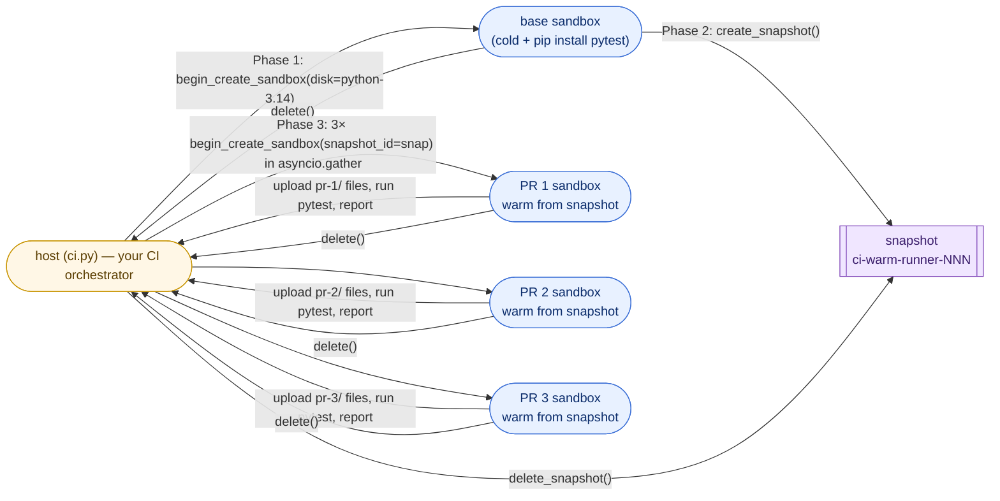
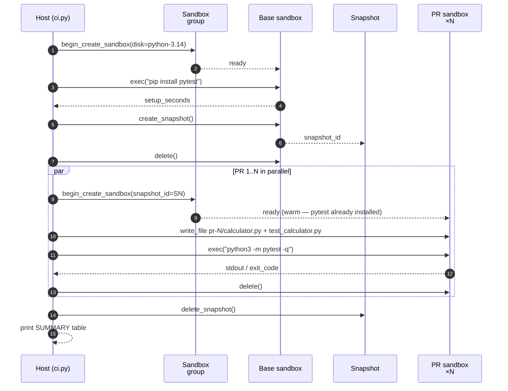

# 06-developer-workflows — Ephemeral CI on snapshot-warm-started sandboxes

What happens when every PR build runs in its own fresh Linux VM?
Historically, "fresh VM per build" was a luxury — boot was too slow.
Sandboxes change that math: with a **snapshot** of the warm runner
image, cold-start drops to seconds, and a real "one sandbox per PR"
posture becomes practical.

This scenario demonstrates the pattern end to end:

1. **Cold-boot a base runner**, install pytest (~10–15 s).
2. **Snapshot** the post-install state — this is the warm CI image.
3. **For each pending PR**, in parallel, **create a sandbox from the
   snapshot**, upload the PR's diff, run the test suite, report
   pass/fail back to the host.
4. **Tear down everything** — each PR's sandbox, then the snapshot.

The result is true per-build isolation (every PR sees its own
filesystem, no leakage from previous runs) without paying cold-start
for every PR.

Composes [`guides/01-sandboxes`](../../guides/01-sandboxes),
[`guides/02-snapshots`](../../guides/02-snapshots), and
[`guides/07-files`](../../guides/07-files).

> Looking for **secret injection** for `git clone` of a private repo?
> See [`02-coding-agents`](../02-coding-agents) — the egress-proxy
> Transform-rule pattern there is the production recipe for
> never-in-workload PATs and slots straight into this flow.

## Architecture



## How a CI run unfolds



## What's in the box

```
06-developer-workflows/
├── README.md                       (this file)
└── python/
    ├── README.md
    ├── requirements.txt
    ├── ci.py                       host: drives the whole CI run
    └── prs/                        synthetic PR diffs (uploaded into PR sandboxes)
        ├── pr-1/                   clean implementation; tests PASS
        │   ├── calculator.py
        │   └── test_calculator.py
        ├── pr-2/                   adds mod() + pow() with new tests; PASS
        │   ├── calculator.py
        │   └── test_calculator.py
        └── pr-3/                   intentional regression in mul(); FAIL
            ├── calculator.py
            └── test_calculator.py
```

The three `prs/pr-N/` directories stand in for whatever your real CI
would `git clone --branch <ref>` into the sandbox. Each PR's code +
tests is just uploaded with `sandbox.write_file(...)` — drop your own
PR diff source in as `prs/pr-N/...` and it works the same way.

## Run it

```bash
cd python
pip install -r requirements.txt
python ci.py                    # builds pr-1, pr-2, pr-3 (defaults)
python ci.py pr-1 pr-2          # only those two
python ci.py pr-3               # see a failing PR by itself
```

Wall time: about 60–90 s end to end (cold boot + pip install
dominates; the parallel PR phase is ~20–25 s for 3 PRs).

## Expected output (last block)

```text
========================================================================
CI SUMMARY
========================================================================
  base cold boot         :  18.3s
  pip install pytest     :  11.2s
  snapshot creation      :   3.4s
  parallel PR phase      :  22.7s  (wall)

  PR         boot   tests verdict summary
  -------- ------ ------- ------- ----------------------------------------
  pr-1       12.4s    1.0s PASS    5 passed in 0.07s
  pr-2       12.6s    1.1s PASS    8 passed in 0.08s
  pr-3       12.5s    1.0s FAIL    1 failed, 4 passed in 0.09s

  [pr-3] FAILED — last 6 line(s) of pytest output:
    F                                                                        [ 20%]
    =================================== FAILURES ===================================
    ___________________________________ test_mul ___________________________________
    >       assert mul(3, 7) == 21
    E       assert 10 == 21
    ...

  TOTAL: 2 / 3 PRs passed

  Warm boot mean: 12.5s vs cold base 29.5s (2.4× faster per PR).
```

The script's process exit code is **non-zero** when any PR fails — drop
this into a `gh workflow run` or `azure-pipelines.yml` step and the
build will go red the same way you're used to.

## Why this is interesting

1. **Per-build isolation, real.** Every PR gets its own VM. There is no
   shared filesystem, no lingering process from a previous PR, no
   risk that "PR A polluted the env for PR B". Per-build isolation
   used to mean "spend two minutes booting per PR" — the snapshot
   trick collapses that.
2. **Cold start once, amortised across all PRs.** Pay the heavy
   `pip install` once on the base sandbox, snapshot, and every
   subsequent PR boots from that snapshot. With 30 PRs in a day, you
   pay one cold start and 29 warm ones.
3. **Trivially horizontal.** The PR phase is `asyncio.gather` over N
   `begin_create_sandbox(snapshot_id=...)` calls. Want to build all
   open PRs in the org at once? Bump the parallelism.
4. **No CI agent pool.** No long-lived runner VMs to keep healthy,
   no agent registration step, no pool sizing math. The "agent" is
   the sandbox you boot the moment work arrives.

## Production tips

- **Bake the warm runner once, then reuse forever.** This demo creates
  the snapshot per run. In production, build the warm runner image with
  [`guides/03-disks`](../../guides/03-disks) (`begin_commit` or
  `begin_create_disk_image`) and have CI reference that disk image
  by ID. You skip Phase 1 entirely on every CI run.
- **Pin tool versions in the warm runner.** Reproducible builds need
  reproducible runners. Capture exact pip / apt versions when you bake
  the disk; tag the disk image with the build SHA so you can roll back.
- **Inject secrets via the egress proxy, not via env.** This demo's
  runners don't need credentials — they only run tests. For real PR
  builds that `git clone` private repos or push to registries, follow
  the [`02-coding-agents`](../02-coding-agents) recipe: keep the PAT in
  the sandbox-group egress policy and stamp it onto outbound requests
  at the network boundary, so it never enters the sandbox env / disk /
  memory.
- **Egress lockdown for hostile-PR CI.** A PR can ship arbitrary code
  into your test runner. Pair with
  [`guides/08-egress`](../../guides/08-egress) and
  `set_egress_default("Deny")` plus host allows for `pypi.org`,
  `github.com`, your container registry, and nothing else. A
  prompt-injected or backdoored test can't reach `attacker.com` to
  exfiltrate even the test source.
- **Label by `pr_number` and `commit_sha`.** Pair with
  [`guides/11-labels`](../../guides/11-labels) so a janitor can
  `list_sandboxes(labels={"pr_number": "1234"})` and reap stragglers
  if your CI orchestrator crashes mid-run.
- **AutoSuspendPolicy for on-demand dev environments.** Pair with
  [`guides/05-lifecycle`](../../guides/05-lifecycle). The same
  ephemeral-runner pattern (boot from a warm snapshot, expose port for
  the dev server, idle-suspend after 5 min) is exactly what an
  on-demand dev environment looks like — drop a developer URL on the
  PR check and they have a live preview without setting anything up.
- **Cache deeper than pytest.** For real workloads, the snapshot
  should include a populated pip cache (`pip download`) and your
  application's deps (`pip install -r requirements.txt`), not just the
  runner. Cuts each PR's test phase from "install everything" to
  "rebuild what changed".
- **One snapshot per language major.** A polyglot monorepo wants
  separate warm runners for python-3.14, node-22, go-1.23, etc.
  Tag and look them up by language/version label.

## What this is not

- Not a replacement for `gh actions` / `azure-pipelines` / `buildkite`.
  This shows the **runtime** for those orchestrators to dispatch onto;
  pipeline YAML, PR gating, status checks, artifact upload — those
  remain in the platform you already use.
- Not a build cache. Each PR's test phase reruns from scratch. For
  large monorepos add Bazel/Buck/turborepo-style remote caching;
  sandboxes give you the isolated runner, not the cache.
- Not multi-tenant out of the box. A real CI service hosting builds for
  many customers wants per-customer sandbox groups (so noisy-neighbour
  blast radius stays per-group) plus the labels + lifecycle hygiene
  tips above.
