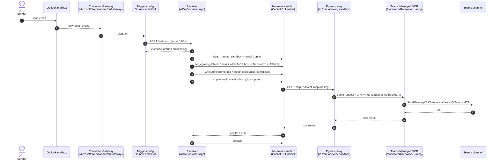

# 10-connectors-email-triage — Email → sandbox → Teams, with `azd up`

> A new Outlook email fires an **Azure Connector Gateway** trigger →
> the gateway POSTs to an ACA receiver → the receiver boots a fresh
> sandbox per email → **GitHub Copilot CLI** in the sandbox classifies
> the email and posts a triage card to a Teams channel using the
> gateway's **Managed MCP server**. The receiver holds the gateway
> API key; the **egress proxy stamps it onto every outbound MCP call**
> at the sandbox boundary, so the sandbox itself never sees a
> credential.

Composes [`02-coding-agents/gh-copilot-cli`](../02-coding-agents/gh-copilot-cli)
(Copilot CLI + egress-proxy credential mediation) and
[`guides/08-egress`](../../guides/08-egress) (deny-default + Transform
rules).

## Architecture



Where the gateway API key lives (and doesn't):

| Location                                | Key present? |
|-----------------------------------------|--------------|
| Bicep state / azd deployment state      | ❌           |
| Operator shell history                  | ❌           |
| Connector Gateway control plane         | ✅ (issued)  |
| Receiver Container App secret           | ✅           |
| Receiver process env (secretref)        | ✅           |
| Egress proxy in front of the sandbox    | ✅           |
| **Sandbox container env / disk / memory** | **❌**     |
| Outbound MCP request on the wire        | ✅ (stamped by proxy) |

## What this ships

```
10-connectors-email-triage/
├── README.md                  this file
├── azure.yaml                 azd entrypoint (provision + deploy + post-deploy)
├── infra/
│   ├── main.bicep             root template — wires the modules
│   ├── main.parameters.json   azd parameter file
│   ├── modules/
│   │   ├── connector-gateway.bicep    Microsoft.Web/connectorGateways
│   │   ├── connection-office365.bicep .../connections (Office365)
│   │   ├── connection-teams.bicep     .../connections (Teams MCP via a365teamsmcp)
│   │   ├── mcpserver-teams.bicep      .../mcpserverConfigs (kind=ManagedMcpServer)
│   │   ├── sandbox-group.bicep        Microsoft.App/sandboxGroups + SystemAssigned MI
│   │   ├── receiver.bicep             Log Analytics + ACA env + receiver Container App
│   │   └── trigger-on-new-email.bicep .../triggerconfigs (callbackUrl=receiver/webhook)
│   └── scripts/
│       ├── postdeploy.sh      Linux/macOS — listApiKey + secret stamp + consent URLs
│       └── postdeploy.ps1     Windows
├── receiver/                  the trigger receiver code
│   ├── app.py                 FastAPI; webhook → boot sandbox → run Copilot
│   ├── requirements.txt
│   └── Dockerfile
├── prompts/
│   └── triage.md              canonical triage prompt (receiver + local runner read this)
└── python/                    local-dev runner — no azd needed
    ├── README.md
    ├── requirements.txt
    ├── run.py                 boots a sandbox with a sample payload
    └── samples/sample-email.json
```

## Prerequisites

| Requirement | Why | Notes |
|---|---|---|
| **Azure CLI** (`az`) | post-deploy script calls ARM data-plane ops | <https://learn.microsoft.com/cli/azure/install-azure-cli> |
| **`az login`** completed | everything | run once after installing the CLI |
| **Azure Developer CLI** (`azd`) | `azd up` orchestrates provision + deploy + post-deploy | <https://learn.microsoft.com/azure/developer/azure-developer-cli/install-azd> |
| **Docker** | `azd deploy receiver` builds the receiver image | any local container runtime — Docker Desktop, Podman, etc. |
| **Subscription with Connector Gateway preview enabled** | gateway is in preview | Build 2026 preview — confirm region availability before deploying |
| **ACA sandbox group preview** | sandboxes pillar | the rest of `samples/sandboxes/` already requires this |
| **An M365 mailbox + a Teams team you can post to** | OAuth consent during post-deploy | personal dev tenant is fine |

## Cloud-deployed quickstart (`azd up`)

```bash
cd samples/sandboxes/scenarios/10-connectors-email-triage

azd auth login            # one-time, if you haven't already
azd env new email-triage  # any short name
azd env set ACA_SANDBOX_REGION westus2   # any region where sandboxes are available

# Provision + deploy + run the post-deploy hook in one shot.
azd up
```

The post-deploy hook runs **interactively** — it prints two OAuth
consent URLs (Office 365 and Teams) and waits for you to open them in
a browser. Sign in with the M365 account whose mailbox + Teams channel
you want the flow to use. After both connections show
`overallStatus: Connected`, the gateway will start dispatching trigger
events at the receiver and the flow is live.

Verify with:

```bash
az rest --method get \
  --uri "$(azd env get-value RECEIVER_CALLBACK_URL | sed s#/webhook##)/healthz"
# → "ok"
```

Send a test email to the consented mailbox, watch the receiver's logs,
then watch the triage card show up in Teams:

```bash
az containerapp logs show \
  -g "$(azd env get-value AZURE_RESOURCE_GROUP)" \
  -n "$(azd env get-value RECEIVER_CONTAINER_APP_NAME)" \
  --follow
```

## Local-dev quickstart (no `azd up` cycle for prompt iteration)

The `python/run.py` runner boots a sandbox manually with a sample
email payload, runs the same Copilot CLI flow, and points at any
MCP endpoint you give it. Useful for iterating on
[`prompts/triage.md`](prompts/triage.md) without redeploying.

```bash
cd python
pip install -r requirements.txt

# Reuse the cloud deployment's values (run after at least one `azd up`):
export $(azd env get-values | grep -E '^(CONNECTOR_GATEWAY_ID|TEAMS_MCP_SERVER_CONFIG_NAME|CONNECTOR_GATEWAY_API_KEY)=' | xargs)

python run.py --dry-run    # render the prompt + print the egress plan
python run.py              # actually boot the sandbox and run Copilot
```

See [`python/README.md`](python/README.md) for full options.

## What it composes

- [`02-coding-agents/gh-copilot-cli`](../02-coding-agents/gh-copilot-cli)
  — Copilot CLI + egress-proxy credential mediation.
- [`guides/08-egress`](../../guides/08-egress) — `set_egress_default("Deny")`,
  host-allow rules, **plus** Transform rules.
- [`guides/01-sandboxes`](../../guides/01-sandboxes) — boot + exec.
- [`guides/07-files`](../../guides/07-files) — `write_file` for the
  prompt + the MCP server config.
- [`guides/10-identity`](../../guides/10-identity) — Connector Gateway
  uses a SystemAssigned MI; the receiver uses a UserAssigned MI to
  call the SandboxGroup data plane.

## Production tips

- **Replace shared-secret webhook auth with App Service built-in auth +
  Connector Gateway MI**. The current receiver accepts any POST to
  `/webhook` (or, optionally, requires a `x-connector-secret` header
  in dev). For production, put App Service built-in auth in front of
  the Container App (`Microsoft.App/containerApps/authConfigs`),
  validate Entra tokens, and only allow the **Connector Gateway's
  managed identity principalId** through. The reference Functions
  sample uses this pattern — same shape applies here.
- **Scope the gateway API key to one MCP server config**. The
  post-deploy script does this (`scope: $TEAMS_MCP_SERVER_CONFIG_NAME`).
  A compromised receiver can still post to Teams, but it can't reach
  any other MCP server config on the same gateway.
- **Pre-bake the sandbox disk**. Every email currently pays the
  Copilot install (`gh.io/copilot-install`). Snapshot post-install
  ([`guides/02-snapshots`](../../guides/02-snapshots)) or bake a custom
  disk ([`guides/03-disks`](../../guides/03-disks)) and per-email cold
  start drops to seconds.
- **Snapshot the egress-policy-configured state**, not just the
  installed binaries — the Transform rule survives the snapshot and
  every boot inherits the same lockdown.
- **Label sandboxes by message-id**. Pair with
  [`guides/11-labels`](../../guides/11-labels) so a janitor can
  `list_sandboxes(labels={"messageId": ...})` and reap stragglers if
  the receiver crashes mid-run.
- **Auto-suspend slow tasks**. Triage runs are short (~30 s), but for
  follow-on workflows that wait on human approval, pair with
  [`guides/05-lifecycle`](../../guides/05-lifecycle) and an
  `AutoSuspendPolicy` so the sandbox stops billing while the human
  decides.
- **Audit trail**. The receiver emits a `run_id` per email to its
  Container App log stream; the same `run_id` is embedded in the
  Teams card footer. Pipe receiver logs to Log Analytics
  (already provisioned by the bicep) for joined queries.

## Known limitations

- **Connector Gateway is preview.** The `Microsoft.Web/connectorGateways`
  resource family is in Build 2026 preview; Bicep emits `BCP081`
  warnings because the type schema isn't cached. Resources still
  deploy correctly. Expect breaking changes between preview milestones.
- **OAuth consent is interactive.** The post-deploy hook can't
  finish the OAuth dance for you — you open the URLs, sign in, return.
  Once consented, the connection survives across re-runs.
- **Single-tenant.** Both connections are owned by whoever consented.
  Multi-tenant requires using `connections/accessPolicies` and
  per-tenant gateway secrets — out of scope here.
- **No CLI flavor (`aca` CLI script) of this scenario.** The
  Connector Gateway ops aren't (yet) wrapped by `aca sandboxgroup ...` —
  use `az rest` or the `azd` flow above.

## Tear down

```bash
azd down --purge --force --no-prompt
```

Deletes the connector gateway, both connections, the MCP server config,
the trigger config, the sandbox group, the receiver Container App, the
Log Analytics workspace, and the user-assigned MI.
